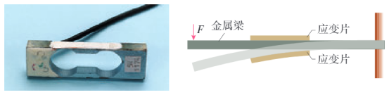

## 讲解

### 是什么

电阻应变片粘在被测物体表面，随表面微小伸长、缩短而改变电阻，把形变转成电学量。金属应变片主要利用电阻应变效应，半导体应变片还明显利用电阻率的压阻效应。力F用N，应变 $\varepsilon=\Delta l/l$ 无量纲，电阻用Ω。

### 怎么来的

金属导体有 $R=\rho l/S$。在温度和电阻率近似固定时，拉伸使l变大、截面积S通常变小，两项都促使R增加；压缩相反。小形变中可用 $\Delta R/R=K\varepsilon$ 表示标定关系，K为应变灵敏系数，不能无条件只保留长度变化。

把两片贴在梁上下表面，梁受力弯曲，一面拉伸、一面压缩；对给定方向的力，一片阻增、一片阻减。输出两片信号差可增强形变信号，并减少某些共同温度影响。具体方向须看固定端、施力方向，不能永远认定“上增下减”。

### 什么时候能用

小形变、弹性范围内，粘贴可靠且温度影响可控制。恒流检测有 $U=IR$，故R增大时该片电压增大；恒压检测就不能照搬此电压趋势。真实常用桥式测量另有分压关系，可参照[NI应变测量](https://www.ni.com/getting-started/set-up-hardware/data-acquisition/i/strain-gages)。

下图与恒流条件来自本章知识清单：

如图为一种应变式力传感器，主要结构为金属梁和电阻应变片。工作原理如右图所示，其中弹簧钢制成的梁形元件右端固定，在梁的上下表面各贴一个应变片。

当在梁的自由端施力F时，梁发生弯曲，上表面拉伸，下表面压缩，上表面应变片的电阻变大，下表面应变片的电阻变小。如果让应变片中通过的电流保持恒定，那么上表面应变片两端的电压变大，下表面应变片两端的电压变小。传感器把这两个电压的差值输出。力F越大，应变片的弯曲形变越大，电阻变化越大，输出的电压差值就越大。

## 例题

> 题目与解析：第五章 传感器（专项训练）（解析版）.docx，来源ID S02，第41—52段。分段选取时保留该子问的完整题干、答案与解析；题目背景和原资料标注照录。

4．（24-25高二下·山东烟台·月考）以下关于传感器的说法错误的是（　　）

A．将声音信号转化为电信号

B．图b为电熨斗的构造示意图，熨烫丝绸衣物需要设定较低的温度，此时应降低升降螺钉的高度

C．图c为加速度计示意图，当向右减速时，P点电势高于Q点电势

D．图d为应变片测力原理示意图。在梁的自由端施加向下的力F，则梁发生弯曲，上表面应变片电阻变大，下表面应变片电阻变小

**原资料答案：** B

**原资料详解：** 

A．图a为电容式话筒的组成结构示意图，振动膜片与固定电极间的距离发生变化，从而实现将声音信号转化为电信号，故A正确；

B．熨烫丝绸衣物需要设定较低的温度，调温旋钮应该向上旋，使得双金属片弯曲较小时，触点就分离，这样保证了温度不会过高，故B错误；

C．图c为加速度计示意图，当向右减速时，加速度向左，则滑片向右移动，此时P点电势高于Q点电势，故C正确；

D．在梁的自由端施加向下的力F，上应变片长度变长，电阻变大，下应变片长度变短，电阻变小，故D正确。

本题选择错误选项，故选B。

### 顺着本题再看清一步

原题选“错误”的B。A是膜片改变电容、把声信号转电信号；C右行减速意味着加速度向左，按原图滑片惯性偏右，P电势高于Q；D中梁向下弯，上表面拉伸、下表面压缩，上片阻增、下片阻减。恒流输出不是该选择题额外给定的数据，下面的恒流来由来自本章知识清单，不把它冒充原题条件。

## 易错

原题图d左端向下受力、右端固定，上表面拉伸、下表面压缩。先判应变，再用ρl/S判R，最后在恒流条件下判U，不能跳过供电条件。
