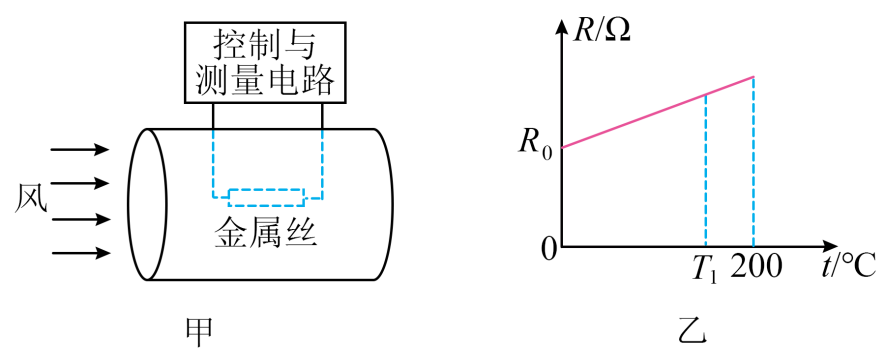

## 讲解

### 是什么

金属热电阻利用特定金属的电阻随温度可重复变化来测温。资料所用金属丝在工作范围内温度升高、阻值增大。电阻R用Ω，温度可用℃；近似温差关系可写 $R=R_0[1+\alpha(t-t_0)]$，α单位℃⁻¹。

### 怎么来的

温度上升使金属晶格热运动更强，导电电子散射增强，常见测温金属电阻率升高。用小测量电流读电压，再由欧姆定律求R，按标定曲线换回温度。近似线性式是在有限区间的拟合，不是任意温度下的精确规律。

热线风速仪另有一层应用：将金属丝保持在固定温度，风带走热量后由控制电流补回。稳态时电热功率 $U^2/R$ 等于散热功率，电压反映所需补热，而不是金属丝温度必然随风速变。

### 什么时候能用

固定工作温度T₁时R固定；调整T₁时R也变，必须两步分析。不能把所有金属、所有温度范围都视为严格正温度系数直线。电阻测温还须避免明显自热影响测量对象。[OMEGA热电阻说明](https://mx.omega.com/prodinfo_eng/rtd.html)可核对元件与标定概念。

下面例题是恒温风速测量，不是直接读取温度的题；先用固定T₁判断R，再用能量平衡追踪风速。

## 例题

> 题目与解析：第五章 传感器（专项训练）（解析版）.docx，来源ID S02，第88—99段。分段选取时保留该子问的完整题干、答案与解析；题目背景和原资料标注照录。

8．（25-26高三上·北京东城·期末）图甲所示的是恒温式热线风速仪的结构示意图，将一根细金属丝置于圆柱形通道内，设定其工作温度恒为$T_{1}$。风速仪正常工作时，接通电路，金属丝升温到$T_{1}$，风流过通道，会带走部分热量，风速仪通过控制电路改变流过金属丝的电流维持金属丝的温度$T_{1}$不变。风速仪通过测量金属丝两端的电压、进入通道时风的温度$t_{0}$，从而实现对风速的测量。已知风速越大，金属丝与风的温度之差越大，单位时间内风带走的热量越多。金属丝电阻R随温度t变化的关系如图乙所示。假设空气密度始终不变，下列说法正确的是（    ）

A．当$t_{0}$不变，所测风速增大时，金属丝两端的电压减小

B．当风速不变，$t_{0}$越高时，金属丝两端的电压越大

C．若风速仪测得的电压和$t_{0}$均变大，可判断风速变大

D．若工作温度$T_{1}$增大，风速仪测得的电压和$t_{0}$均不变，可判断风速变大

**原资料答案：** C

**原资料详解：** 

A．当${t}_{0}$不变，所测风速增大时，单位时间内风带走的热量越多，为维持金属丝的温度$T_{1}$不变，需增大流过金属丝的电流，所以金属丝两端的电压增大，故A错误；

B．当风速不变，${t}_{0}$越高时，金属丝与风的温度之差越小，单位时间内风带走的热量越少，为维持金属丝的温度$T_{1}$不变，需减小流过金属丝的电流，所以金属丝两端的电压变小，故B错误；

C．若风速仪测得的电压和${t}_{0}$均变大，金属丝与风的温度之差变小，金属丝两端的电压需增大来维持金属丝的温度$T_{1}$不变，可判断单位时间内风带走的热量变多，风速变大，故C正确；

D．若工作温度$T_{1}$增大，金属丝电阻变大，因风速仪测得的电压和${t}_{0}$均不变，故金属丝与风的温度之差变大，但金属丝产生热量$Q=\frac{{U}^{2}}{R}t$减少，可判断风速变小，故D错误。

故选C。

### 顺着本题再看清一步

t₀不变风速增大需更大电热功率，A电压减小错误；风速不变t₀升高温差减小，所需电压减小，B错误。C在温差减小的同时电压还增大，说明风速必须增大才能解释更强散热。D提高T₁使R增大，同电压发热功率反降，配合温差增大只能判风速减小。

## 易错

资料“风速越大，温差越大”应按两项因素分别理解：T₁、t₀固定时，风速增大不改变温差，只增加散热。控制电路补热让金属丝维持T₁。
