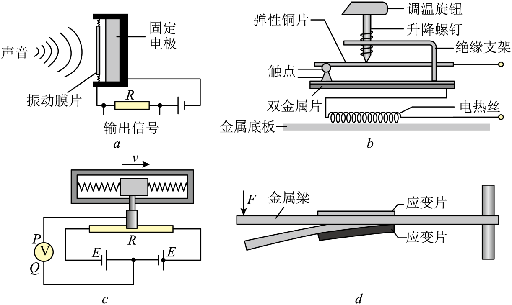

## 讲解

### 判据

给上下应变片、梁弯曲和“电流保持恒定”，问各片电压或输出差。恒流是把R变化直接转成U变化的关键条件。

### 流程

1. 根据施力方向和固定端看拉伸面、压缩面。资料左自由端受向下力、右端固定，上面拉伸、下面压缩。
2. 用 $R=\rho l/S$：温度与ρ近似固定，拉伸使l增、S减，R增；压缩R减。半导体压阻还要使用相应ρ变化特性。
3. 恒定电流I通过各片时 $\Delta U=I\Delta R$，所以上片电压增加、下片减少。若两片初始相同、同电流，差分输出 $U_{\text{上}}-U_{\text{下}}=I(R_{\text{上}}-R_{\text{下}})$。
4. 小形变弹性范围中，形变随力变大，差分信号可随力增强；是否严格线性取决于梁与元件标定，不能自动把整个量程写成正比。

下方原选择题验证形变—阻值环节；恒流电压推演来自本章知识清单，资料没有专门的恒流数值题，不添造读数。

## 例题

> 题目与解析：第五章 传感器（专项训练）（解析版）.docx，来源ID S02，第41—52段。分段选取时保留该子问的完整题干、答案与解析；题目背景和原资料标注照录。

4．（24-25高二下·山东烟台·月考）以下关于传感器的说法错误的是（　　）

A．将声音信号转化为电信号

B．图b为电熨斗的构造示意图，熨烫丝绸衣物需要设定较低的温度，此时应降低升降螺钉的高度

C．图c为加速度计示意图，当向右减速时，P点电势高于Q点电势

D．图d为应变片测力原理示意图。在梁的自由端施加向下的力F，则梁发生弯曲，上表面应变片电阻变大，下表面应变片电阻变小

**原资料答案：** B

**原资料详解：** 

A．图a为电容式话筒的组成结构示意图，振动膜片与固定电极间的距离发生变化，从而实现将声音信号转化为电信号，故A正确；

B．熨烫丝绸衣物需要设定较低的温度，调温旋钮应该向上旋，使得双金属片弯曲较小时，触点就分离，这样保证了温度不会过高，故B错误；

C．图c为加速度计示意图，当向右减速时，加速度向左，则滑片向右移动，此时P点电势高于Q点电势，故C正确；

D．在梁的自由端施加向下的力F，上应变片长度变长，电阻变大，下应变片长度变短，电阻变小，故D正确。

本题选择错误选项，故选B。

### 顺着本题再看清一步

原题选“错误”的B。A是膜片改变电容、把声信号转电信号；C右行减速意味着加速度向左，按原图滑片惯性偏右，P电势高于Q；D中梁向下弯，上表面拉伸、下表面压缩，上片阻增、下片阻减。恒流输出不是该选择题额外给定的数据，下面的恒流来由来自本章知识清单，不把它冒充原题条件。

## 易错

恒流下电压随阻值变；若实际为恒压或电桥供电，需用真实电路重新求U。不可只凭“应变片”套恒流结论。
