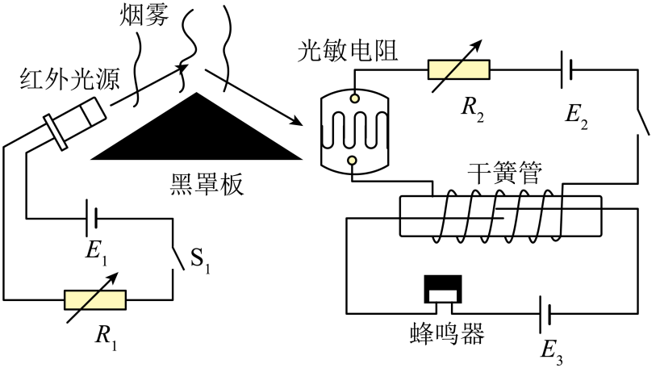

## 讲解

### 判据

题目给传感元件、控制电路、执行电路，问输入改变后能否报警或如何改变触发条件。逐段追踪，不从阻值直接跳到蜂鸣器。

### 流程

1. 外界量变→敏感元件输入变。烟雾散射装置中烟浓使接收光增强，遮挡型装置却可能相反，先读光路。
2. 用题给特性把光或温度转成R变化，再按控制电源与连接求线圈电流或控制节点电压。
3. 判断控制信号是否跨过吸合或导通门槛；线圈电流增强通常增强磁场，但匝数也会影响。
4. 根据动触点吸合后实际接在哪里，判断工作回路导通。另一个工作电源只影响执行负载，不一定改变控制门槛。
5. 要降低触发浓度，先说明低浓度导致的控制信号减弱，再选择能补偿这项减弱的调整，而不是把所有电源、阻值都朝同一方向调。

## 例题

> 题目与解析：第五章 传感器（专项训练）（解析版）.docx，来源ID S02，第76—87段。分段选取时保留该子问的完整题干、答案与解析；题目背景和原资料标注照录。

7．（25-26高二上·河南郑州·期末）光电式火灾报警器的原理如图所示，红外光源发射的光束经烟尘粒子散射后照射到光敏电阻上，光敏电阻接收的光强与烟雾的浓度成正比，其阻值随光强的增大而减小。闭合开关，当烟雾浓度达到一定值时，干簧管中的两个簧片被磁化而接通，触发蜂鸣器报警。为了能在更低的烟雾浓度下触发报警，下列调节正确的是（　　）

A．增大电阻箱${R}_{1}$的阻值

B．减小电阻箱${R}_{2}$的阻值

C．增大电源${E}_{3}$的电动势

D．减小干簧管上线圈的匝数

**原资料答案：** B

**原资料详解：** 

A．增大电阻箱${R}_{1}$的阻值，则红外光源发出的红外线强度减小，若烟雾浓度降低，则光敏电阻接收的光强降低，阻值变大，则干簧管的电流减小，则干簧管中的两个簧片不能被磁化而接通，触发蜂鸣器不能报警，故A错误；

B. 若烟雾浓度降低，则光敏电阻接收的光强降低，阻值变大，若再减小电阻箱${R}_{2}$的阻值，则干簧管的电流增大，则干簧管中的两个簧片被磁化而接通，触发蜂鸣器报警，故B正确；

C．增大电源${E}_{3}$的电动势，对干簧管的通断无影响，故C错误；

D．减小干簧管上线圈的匝数，干簧管中产生磁场强度减弱，则干簧管中的两个簧片不能被磁化而接通，蜂鸣器不报警，故D错误。

故选B。

### 顺着本题再看清一步

更低烟浓→散射光弱→光敏R大→控制线圈电流小。B减小R₂可补偿，保持触发所需电流；A减弱原光源、D减少匝数都相反；C只调工作蜂鸣器电源，不能使干簧管提前吸合。

## 易错

E₃只给蜂鸣器供电，不决定干簧管吸合门槛；减小线圈匝数会削弱磁场，不利于低浓度报警。
