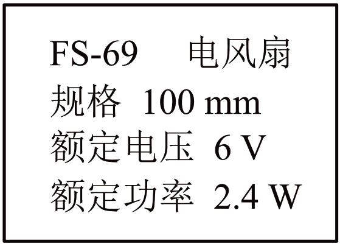

## 错法

看到U、I就把UI当发热，再用U²/r求热功率。这个错法把运行电机当作纯电阻，省掉了电能转为机械能的去向；另一种常见错误是用额定U/r线算工作电流。

## 正解

先按状态求真实电流。停转测阻可在本题无机械输出模型下用r线＝U/I；正常转动从输入功率求I＝P入/U，再用I²r线求发热。

$$P_{\text{入}}=UI=P_{\text{热}}+P_{\text{机}},\qquad P_{\text{热}}=I^2r_{\text{线}}$$

线圈压降Ir线并不等于电机总端电压，故运行时UI与I²r线不相等。若还计其他损耗，需在右侧再加题目给定损耗，不能凭空假设其数值。

## 例题

> 题目与解析：第十二章 电能 能量守恒定律（单元测试·基础卷）（解析版）.docx，来源ID S06，第111—123段。分段选取时保留该子问的完整题干、答案与解析；题目背景和原资料标注照录。

7．某型号小电风扇铭牌上的主要参数如图所示。当在小电风扇上加$2\,\mathrm V$电压时，小电风扇不转动，测得通过它的电流为$0.4\,\mathrm A$，根据题中和铭牌上提供的信息可知（　　）

A．小电风扇的内阻为$5\,\Omega$

B．当在小电风扇上加$6\,\mathrm V$电压时通过的电流为$1.2\,\mathrm A$

C．小电风扇正常工作时的机械功率为$2.0\,\mathrm W$

D．小电风扇正常工作时的热功率为$0.4\,\mathrm W$

**原资料答案：** A

**原资料详解：** 

A．当在小电风扇上加$2\,\mathrm V$电压时，小电风扇不转动，测得通过它的电流为$0.4\,\mathrm A$，可以解得小电风扇的内阻为$r=\frac UI=5\,\Omega$，故A正确；

B．当在小电风扇上加$6\,\mathrm V$电压时电风扇正常工作，即其功率为2.4W,此时电流为$I_2=\frac PU=0.4\,\mathrm A$，故B错误；

C

D．小电风扇正常工作时，其热功率为$P_{\text{热}}=I_2^2r=0.8\,\mathrm W$

小电风扇正常工作时的机械功率为$P_{\text{机}}=P-P_{\text{热}}=1.6\,\mathrm W$

故CD错误。

故选A。

### 顺着本题再看清一步

原题A正确，B、C、D都可从同一功率账排除：额定电流0.4 A，热0.8 W、机械1.6 W，加回输入2.4 W。题中5 Ω是线圈电阻，不是运行电机端电压/工作电流得到的15 Ω。
