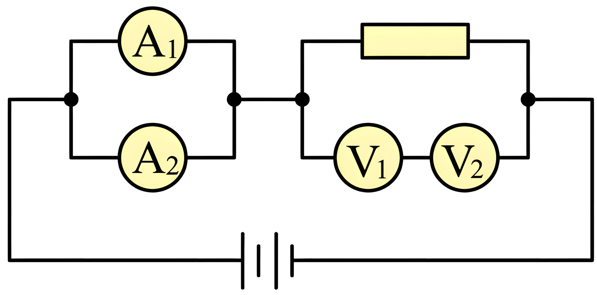

## 讲解

### 是什么

串联的元件在同一条无分支路径上，电流相同；并联的各支路接在同两个节点之间，电压相同。节点按理想导线的连通性确定，画在同一排或相邻并不决定串并联。

串联U总＝各部分U相加，R总＝各R相加；并联I总＝各支路I相加，1/R总＝各1/R相加。R等效只描述两端电压与总电流关系，不表示每个元件原来的电流、功率都等于总值。

### 怎么来的

稳态节点不持续积累电荷，所以流入电流代数和等于流出；串联没有分流，同一电流走过各元件。沿路径电势差相加，串联U＝I(R₁+R₂)，除以I得R总＝R₁+R₂。

并联支路共用两节点，每支路I_i＝U/R_i，总I＝U(1/R₁+1/R₂)。与I＝U/R总比较得倒数和。两个正电阻并联时R总小于任一支路，增加支路让等效R更小。

串联分压与R成正比，并联分流与R成反比；在两正电阻并联中I₁/I₂＝R₂/R₁。此处是稳态欧姆元件关系，非线性灯泡要按当前工作点处理。

### 什么时候能用

化简前保留电表实际内阻与开关状态。理想电压表可近似断路，理想电流表可近似零阻；实际表头不能这样删，否则表头改装题会丢掉分流分压的目的。

若两元件的公共端还连着第三支路，它们不一定串联。交叉导线要看是否有连接点，短接把节点合并，先重画拓扑再化简。

## 例题

> 题目与解析：第十一章 电路及其应用（单元测试·基础卷）（解析版）.docx，来源ID S06，第81—92段。题目背景与原资料标注照录。

8．四个相同的小量程电流表（表头）分别改装成两个电流表$A_{1}$、$A_{2}$和两个电压表$V_{1}$、$V_{2}$，已知电流表$A_{1}$量程大于$A_{2}$的量程，电压表$V_{1}$的量程大于$V_{2}$的量程，改装好后把它们按如图所示接入电路，则（　　）

A．电流表$A_{1}$的读数小于电流表$A_{2}$的读数

B．电流表$A_{1}$的偏转角等于电流表$A_{2}$的偏转角

C．电压表$V_{1}$的读数大于电压表$V_{2}$的读数

D．电压表$V_{1}$的偏转角大于电压表$V_{2}$的偏转角

**原资料答案：** BC

**原资料详解：** 

A．电流表是由表头并联电阻改装而成，电流表$A_{1}$的量程大于电流表$A_{2}$的量程，故电流表$A_{1}$的阻值小于电流表$A_{2}$的阻值；并联电路中，电阻小的支路电流大，故电流表$A_{1}$的读数大于电流表$A_{2}$的读数，故A错误；

B．两个电流表$A_{1}$、$A_{2}$的表头是并联关系，电压相同，通过两个电流表$A_{1}$、$A_{2}$的表头电流相等，则电流表$A_{1}$的偏转角等于电流表$A_{2}$的偏转角，故B正确；

C．电压表是由表头串联电阻改装而成，电压表$V_{1}$的量程大于$V_{2}$的量程，故电压表$V_{1}$的阻值大于电压表$V_{2}$的阻值；串联电路中，阻值大的两端电压大，故电压表$V_{1}$的读数大于电压表$V_{2}$的读数，故C正确；

D．两个电压表$V_{1}$、$V_{2}$的表头是串联关系，电流相等，故电压表$V_{1}$的偏转角等于电压表$V_{2}$的偏转角，故D错误。

故选BC。

### 顺着本题再看清一步

A₁量程更大，分流电阻更小、总内阻更小，并联后总读数I_A1>I_A2，A错误。两个相同表头仍接于同两节点，各头电压相同、Rg相同，所以Ig相同、偏角相同，B正确。

V₁量程大，串联附加电阻较大，改装总内阻大；两电压表串联总电流相同，V₁读数大，C正确。其表头也串联、Ig相同，偏角相同，D错误。答案BC，把外部总量与内部表头量分开后不矛盾。

## 易错

电流表量程大不等于相同电路中偏角大；表头电流与改装后的总电流不同，电压表读数与表头本身电压不同。
