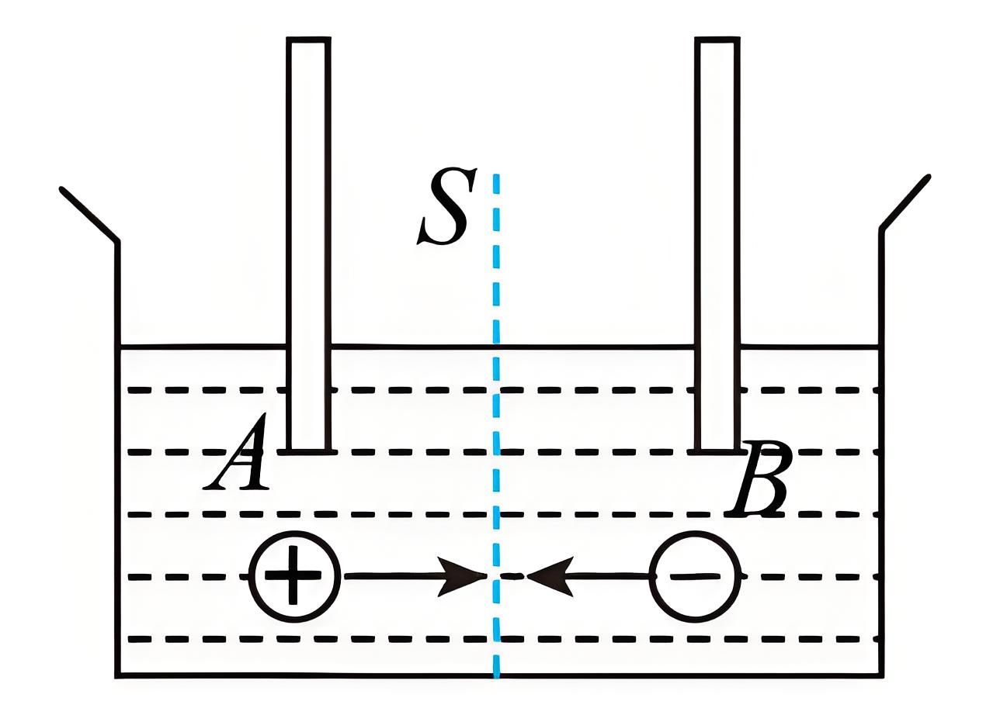

## 讲解

### 是什么

电流由电荷定向移动形成，大小描述单位时间通过某横截面的电荷转移量，单位A，1 A＝1 C/s。大小与方向不随时间变的是恒定电流。

$$\bar I=\frac{\Delta Q}{\Delta t}$$

有限时间给平均电流；恒定时平均值等于瞬时值。方向规定为正电荷定向移动方向，与电子运动方向相反。电路中的I按所选支路方向作有符号代数计算，不按平行四边形法则合成，所以不是矢量。

### 怎么来的

设均匀导体截面积S，单位体积有n个可移动载流粒子，各粒子电荷量大小q，平均定向速率v。时间Δt内穿过截面的粒子来自长vΔt的柱体，体积SvΔt；粒子数nSvΔt，总电荷量ΔQ＝nqSvΔt。再代宏观定义式，约去Δt：

$$I=\frac{nqSv\Delta t}{\Delta t}=nqSv$$

n的单位m⁻³，S为m²、v为m/s、q为C，乘积单位C/s。这里v是平均定向速率，不是电子无规则热运动的速率，也不是电信号传播速度。

多种载流粒子共同导电时，先按正电荷移动方向换算每种贡献再相加。本题正离子向右、负离子向左，两个电流贡献都向右，所以不是用正负粒子数相减。

### 什么时候能用

微观式针对相应均匀截面、已知平均定向运动和载流数密度；不同材料的n可能不同，不能只比S与v。稳态串联相同材质导体中I相同，截面小处v可更大。

电流不是电子“从电源出发跑到灯泡”后才出现；导体内原已有载流粒子。外电路电流一般由电源正极到负极，电子相反；电源内部推动载流粒子需要非静电作用。

## 例题

> 题目与解析：第十一章 电路及其应用（单元测试·基础卷）（解析版）.docx，来源ID S06，第93—104段。题目背景与原资料标注照录。

9．如图所示，电解池内有一价离子的电解液，在时间$t$内通过溶液截面$S$的正离子数为$n_1$，负离子数为$n_2$。设元电荷为$e$，则以下说法正确的是（　　）

A．电流既有大小，又有方向，是矢量

B．$I=\frac qt$适用于任何电荷的定向移动形成的电流

C．溶液内电流方向从$A$到$B$，电流大小为$\frac{(n_1+n_2)e}{t}$

D．溶液内电流方向从$A$到$B$，电流大小为$\frac{n_1e}{t}$

**原资料答案：** BC

**原资料详解：** 

A．根据矢量的含义可知，矢量既有大小，又有方向，运算时遵守平行四边形定则；虽然电流有大小，又有方向，但其运算时不遵循平行四边形定则，因此电流不是矢量，故A错误；

B．公式$I=\frac qt$是电流的定义式，是比值定义法，适用于任何情况，故B正确；

CD．电流的方向与正电荷定向移动的方向相同，与负电荷定向移动的方向相反，由图可得溶液内电流的方向从A到B；设电解液中通过截面S的电荷量为q，根据题意得$q=(n_1+n_2)e$

故溶液内电流的大小为$I=\frac qt=\frac{(n_1+n_2)e}{t}$，故C正确，D错误。

故选BC。

### 顺着本题再看清一步

A错误，电流有支路方向但不按矢量合成；B正确，本式在时间t内给平均电流；C正确，两种一价离子贡献同向，I＝(n₁+n₂)e/t，从A到B；D仅计正离子n₁，漏掉负离子贡献。

若两种异号粒子反而同向通过，则两个电流贡献反向，才需要作差；不能只看电荷符号决定加减，必须同时看移动方向。

## 易错

n在微观式通常表示数密度，本原题n₁、n₂表示通过截面的粒子总数，单位不同。反向移动的异号粒子电流可以同向相加。
