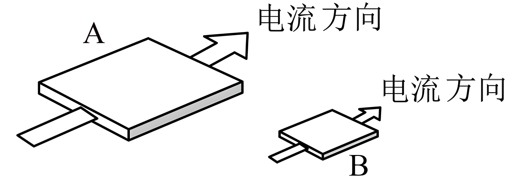

## 讲解

### 是什么

电阻R描述元件对电流的阻碍，在某工作状态用两端电压U与通过电流I的比值表示，单位Ω。

$$R=\frac UI$$

对温度等状态不变的欧姆导体，U和I成比例、R不变。对灯丝或其他非线性元件，工作点改变可伴随温度或导电状态变化，使U/I改变；不能把“所有电阻都与电压无关”当无条件结论。

### 怎么来的

同材质、同温度的均匀导体，可把一根长导体看成多段串联：长度增加让R增加；截面积增加等效于更多细通道并联，让R减小。材料因素用电阻率ρ记录，得到

$$R=\rho\frac lS$$

l沿电流方向，S垂直电流的截面，ρ单位Ω·m。厚度相同的方形金属片，边长变成两倍，电流路程l和截面宽度都变两倍，R中的比例l/S并未改变。因此不能只看“片更大”就判R更大或更小。

电阻率属于材料与状态的性质；导体电阻还含尺寸。通常金属升温ρ增大，一些半导体或特定热敏材料趋势不同，必须按资料中元件特性判断。

### 什么时候能用

结构式用于均匀、截面一致、给定温度与材料的导体，截面不匀需分段；薄片l与S按电流方向认，不把纸面总面积当截面积。

如果导线拉长，还要看体积是否保持、S是否同时变化；不能只把l增加倍数代进去而固定S。没有电流时0/0不能读出R，但元件仍可有确定电阻。

## 例题

> 题目与解析：第十一章 电路及其应用（单元测试·基础卷）（解析版）.docx，来源ID S06，第35—48段。题目背景与原资料标注照录。

4．如图，A、B 是材料相同、厚度相同、表面为正方形的金属导体，两正方形的边长之比为 2：1，通过这两个导体的电流方向如图所示，不考虑温度对电阻率的影响，则两个导体A与B（　　）

A．电阻率之比为 2：1

B．电阻之比为 1：2

C．串联在电路中，两端的电压之比为 2：1

D．串联在电路中，自由电子定向移动的平均速率之比为 1：2

**原资料答案：** D

**原资料详解：** 

A． AB 是材料相同，则电阻率相同，故A错误；

B．根据题意可知$S_A=2S_B$，$L_A=2L_B$

结合电阻定律$R=\rho\frac LS$可知，AB的电阻之比为$1:1$，故B错误；

C．串联电路电流相等，AB电阻的阻值相等，根据欧姆定律可知，AB电阻两端的电压相等，即两电阻两端的电压之比为$1:1$，故C错误；

D．串联电路电流相等，根据电流的微观表达式$I=neSv=neLdv$

可知自由电子在导体A与B中的定向移动速率之比为$v_1:v_2=L_B:L_A=1:2$，故D正确。

故选D。

### 顺着本题再看清一步

A错误，同材质同温度ρ比1:1；B错误，l比2:1而S比2:1，R比1:1；C错误，串联I相同、R相同，所以U比1:1；D正确，I＝neSv，n、e相同且I相同，v比与S反比，A:B＝1:2。

原解析用L表示方片边宽、d表示厚度，在I＝neLdv中L不是另一个电流方向的独立长度；读图后先写S＝Ld才能不混淆。

## 易错

R与ρ不同；材料相同且温度相同才可把ρ约掉。方片横截面是边宽×厚度，不是方片平面面积。
