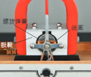
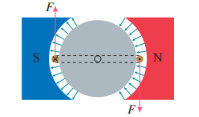
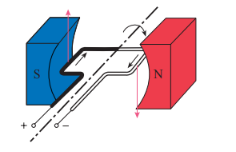
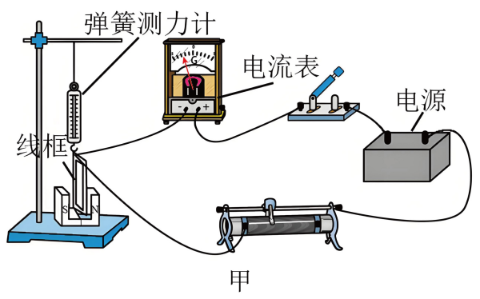
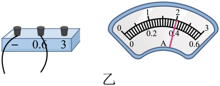

## 讲解

### 是什么

磁电式电流表用通电线圈在磁场中受到的转动作用指示电流。永久磁铁、极靴和软铁圆柱在两侧工作气隙中形成径向磁场；可转动线圈带着指针，螺旋弹簧既供电也提供反抗转动的回复作用。磁场不是处处同向的匀强磁场。

磁电式电流表主要由永久磁铁、线圈、螺旋弹簧、极靴、软铁、指针、刻度盘等构成。

2.特点

两极间的极靴和极靴中间的铁质圆柱，使极靴与圆柱间的磁场都沿半径方向。

这样，无论线圈转到什么位置，线圈平面都与磁场方向平行，线圈左右两边所在处的磁感应强度大小都相等。安培力的大小与电流成正比，安培力的方向总与线圈平面垂直。

3.工作原理：通电线圈在安培力的作用下发生转动。线圈偏转角度越大，被测电流就越大；线圈偏转方向不同，被测电流的方向不同。

### 怎么来的

线圈左右两条有效边长设为$l$，在径向磁场中始终与所在处磁感线垂直，每边受力$F=BIl$。两边的力方向相反，但作用点不同，能使线圈转动。若线圈宽为$b$，两边分别到转轴的距离为$b/2$，每边的力矩是$F(b/2)$，两边相加为$Fb$。

有$N$匝时，磁场转动力矩为$NBlbI$。把线圈面积记作$S=lb$，得到$\tau_B=NBSI$。在弹簧弹性范围内，反抗力矩大小近似$k\alpha$，$\alpha$是偏转角、单位rad，$k$是扭转系数。指针静止时两种力矩平衡：

$$k\alpha=NBSI,\qquad \alpha=\frac{NBS}{k}I$$

所以固定表头的偏角与电流成正比，能使用均匀刻度。电流反向时两边安培力都反向，指针偏转方向反向。

### 什么时候能用

这个线性关系要求径向磁场在工作范围内大小近似恒定，弹簧仍在线性弹性范围内，读数时指针达到稳定。普通磁电式表头适合直流；交流快速正负交替，不能直接按该静态偏角测交流有效值。

表头细线允许电流有限，不能把大电流直接送入线圈。扩大电流量程应给表头并联分流电阻；电流的大部分走分流支路，指针仍反映表头支路的电流。

下列原题直接提供电流表读数和安培力测量，供练习接线柱与刻度对应。本章资料没有单独的“表头转矩计算”例题；没有把这道实验题改造成那类题。

## 例题

> 题目与解析：第一章 安培力和洛伦兹力（单元测试·提升卷）（解析版）.docx，来源ID S10，第190—207段。分段选取时保留该子问的完整题干、答案与解析；题目背景和原资料标注照录。

12．某同学在学习安培力后，设计了如图甲所示的装置来测定磁极间的磁感应强度。已知矩形线框的匝数为n，用刻度尺测出矩形线框短边的长度为L，根据实验主要步骤完成填空：

(1)将矩形线框悬挂在弹簧测力计下端，线框的下短边完全置于U形磁铁的N、S极之间的磁场中，并使线框的短边水平，磁场方向与矩形线框的平面      （填“平行”或“垂直”）；

(2)闭合开关，调节滑动变阻器使电流表的读数为$I_{1}$，记录线框静止时弹簧测力计的读数$F_{1}$，线框所受安培力的方向竖直向下；仅调节滑动变阻器使电流表的读数为$I_{2}$，记录线框静止时弹簧测力计的读数$F_{2}$（$F_{2}$>$F_{1}$），此时线框所受安培力的方向      ；

(3)某次实验电流表接线和表盘如图乙所示，该电流表的读数是      A；

利用上述数据可得待测磁场的磁感应强度大小。B=      。（用n、L、$I_{1}$、$I_{2}$、$F_{1}$和$F_{2}$表示）

**原资料答案：** ．(1)垂直

(2)竖直向下

(3)0.40

(4)$\frac{F_2-F_1}{nL(I_2-I_1)}$

**原资料详解：** （1）应使矩形线圈所在的平面与N、S极的连线垂直，这样能使弹簧测力计保持竖直，方便测出弹簧的拉力；

（2）第一次调节滑动变阻器使电流表的读数为$I_{1}$，线框所受安培力的方向竖直向下；第二次仅调节滑动变阻器使电流表的读数为$I_{2}$，则通过线框的电流方向不变，因磁场方向也不变，根据左手定则可知，第二次调节滑动变阻器时，线框所受安培力的方向仍然竖直向下。

（3）电流表接线柱接“−”和“0.6”，量程为0~0.6，分度值为0.02A，指针指在0.40A处，所以读数是0.40A。

（4）当电流为$I_{1}$时，安培力竖直向下，则$F_1=G+nBI_1L$

当电流为$I_{2}$时，安培力竖直向下，则$F_2=G+nBI_2L$

两式相减消去G后得$F_2-F_1=nBL(I_2-I_1)$

解得$B=\frac{F_2-F_1}{nL(I_2-I_1)}$

## 易错

- 两个力大小相等、方向相反不意味着不能转动：还需看作用线和到转轴的距离。
- 径向磁场使线圈工作边保持垂直于当地磁场，不是令整段线圈各处磁场方向相同。
- 同一指针位置在0.6A、3A量程上的数值不同。本题接0.6A柱，最小格0.02A，读0.40A。
- “允许几十微安到几毫安”是资料对常见灵敏表头的概述，具体器材按铭牌与量程，不能一概认作这一个额定值。
