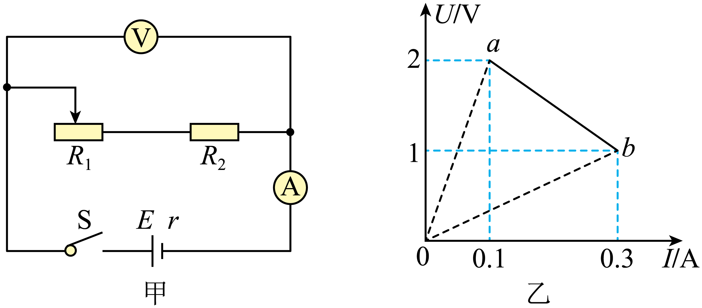

## 讲解

### 是什么

闭合电路包括电源内部与外部。E为电动势，r为内阻，U为电源两端路端电压，I为流过电源的总电流。线性电源供电时

$$E=U+Ir$$

若整个外电路可用纯电阻R表示，U＝IR，才有

$$I=\frac E{R+r}$$

串联时R是外部总串联电阻；并联时先求等效电阻。r和R必须分清，也不能把某个支路电流当作源总电流。

### 怎么来的

通过电路的每单位电荷由电源得到E的能量，其中Ir用于内阻，U用于外电路；相加是E＝U+Ir。在纯电阻外电路，把U＝IR代回：E＝IR+Ir＝I(R+r)，再除以R+r得到I。

要判断路端电压，把E＝U+Ir移项写为U＝E−Ir。固定E、r下，外阻减小让I增大，内部压降Ir增大，路端电压反而减小；电源不是无条件维持固定端电压的装置。

### 什么时候能用

电动机等非纯电阻负载仍可用E＝U+Ir，但不能把线圈电阻直接当外电路等效R代入E/(R+r)。需结合电机输入、输出与损耗或给定工作电流。

开路I＝0、U＝E；短路理想模型R＝0给I＝E/r、U＝0，前提r非零且参数保持。短路只是题目极限，用电表或导线实际短接电源不属于本实验操作。图像中的I必须是该电源总电流。

## 例题

> 题目与解析：第十二章 电能 能量守恒定律（专项训练）（解析版）.docx，来源ID S02，第312—326段。分段选取时保留该子问的完整题干、答案与解析；题目背景和原资料标注照录。

16．（25-26高二上·全国·课堂例题）如图甲所示的电路中，$R_1$是可调电阻，$R_2$是定值电阻，电源内阻为r。实验时调节$R_1$从一端到另一端，得到各组电压表和电流表数据，用这些数据在坐标纸上描点、拟合，作出的$U-I$图像如图乙中ab所示。求：

(1)电源的电动势为多少？

(2)电源的内阻为多少？

(3)定值电阻的阻值是多少？

(4)可调电阻$R_1$的阻值变化范围？

**原资料答案：** (1)2.5V

(2)5Ω

(3)3.3Ω

(4)$0\le R_1\le16.7\,\Omega$

**原资料详解：** （1）根据U=E-Ir，根据图像可知$U_{1}$=2V时，$I_{1}$=0.1A，即2=E-0.1r；当$U_{2}$=1V时，$I_{2}$=0.3A，即1=E-0.3r；联立解得E=2.5V，r=5Ω

（2）由上述计算可知内阻5Ω。

（3）由图像可知，当$R_{1}$=0时$U_{2}$=1V，$I_{2}$=0.3A，可知定值电阻的阻值$R_2=\frac UI=\frac1{0.3}\,\Omega\approx3.3\,\Omega$

（4）由图可知当$R_{1}$调到最大时$U_{1}$=2V，$I_{1}$=0.1A，即$R_{1\max}+R_2=\frac UI=\frac2{0.1}\,\Omega=20\,\Omega$可知$R_{1\max}=16.7\,\Omega$

可知可调电阻$R_1$的阻值变化范围$0\le R_1\le16.7\,\Omega$。

### 顺着本题再看清一步

图线没有画到纵轴，也可以用两个工作点求源参数。把(0.1 A,2 V)和(0.3 A,1 V)分别代入E＝U+Ir，得2＝E−0.1r、1＝E−0.3r。两式相减得1＝0.2r，故r＝5 Ω；再代第一式E＝2+0.1×5＝2.5 V。

滑动电阻从最大调到0时，总外阻降低，电流增加，路端电压降低，所以b对应R₁＝0。此时外电路只剩R₂，R₂＝1/0.3≈3.3 Ω。a点总外阻2/0.1＝20 Ω，减去R₂才得到R₁最大约16.7 Ω。图中原点到工作点的虚线斜率是总外阻，电源直线的负斜率则对应内阻，不能混用。

## 易错

总外阻包括所有外部电阻；看U变化要用E−Ir；理想电表假设与实际电表误差不能在同一步计算中混用。
