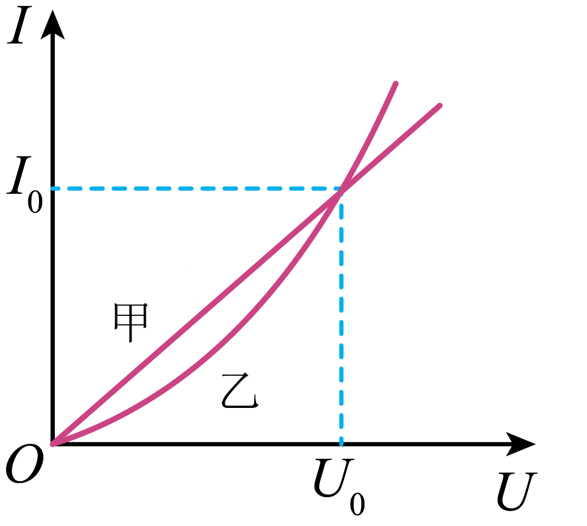

## 讲解

### 判据

先检查横纵轴，再检查直线是否过原点。取工作点算R＝U/I，I-U图原点连线越陡R越小；U-I图原点连线越陡R越大。曲线必须逐个工作点比较，不能直接用切线斜率代R。

### 流程

1. **读轴与单位。** 本题横U纵I，原点到点斜率k＝I/U＝1/R。若纵轴mA，计算前换A，不把“看起来45°”当固定物理斜率。
2. **先定甲。** 甲直线过原点，R甲＝U₀/I₀固定；在U₀/2时，电流I₀/2，这是线性比例的结果。
3. **再逐点定乙。** 在U₀前乙曲线低于甲，给同一U时I乙更小，R乙更大；随U增加乙原点连线斜率变大，R乙减小。
4. **用交点限制比较范围。** U＝U₀时两者R相同；交点之前和之后谁大可能不同，不能把一个工作点排序推广全过程。
5. **区别比值与导数。** 非线性曲线ΔU/ΔI或切线dU/dI描述小变化响应，不是该点U/I。高中此题按比值即可，不需为了求R引入切线。

## 例题

> 题目与解析：第十一章 电路及其应用（专项训练）（解析版）.docx，来源ID S02，第91—100段。分段选取时保留该子问的完整题干、答案与解析；题目背景和原资料标注照录。

7．（25-26高二上·广东·阶段练习）如图为甲、乙两电学元件的伏安特性曲线，其中甲是一条过原点的直线，乙是一条过原点的曲线，两线的交点坐标为$(U_0,I_0)$下列说法正确的是（　　）

A．甲元件随着两端电压的增大，其电阻阻值也增大

B．乙元件随着两端电压的增大，其电阻阻值也增大

C．若在甲元件两端加上$\frac{U_0}{2}$的电压，则流经甲元件的电流小于$\frac{I_0}{2}$

D．若在乙元件两端加上$\frac{U_0}{2}$的电压，则流经乙元件的电流小于$\frac{I_0}{2}$

**原资料答案：** D

**原资料详解：** AB．根据伏安特性曲线可知，甲为线性元件，电阻值保持不变，乙为非线性元件，阻值随着两端的电压的增大而减小，AB错误；

CD．当两电学元件两端的电压均为$U_0$时，两者的电阻均为$\frac{U_0}{I_0}$，当两电学元件两端的电压小于$U_0$时，乙元件的电阻大于$\frac{U_0}{I_0}$。在甲元件两端加上$\frac{U_0}{2}$的电压，根据欧姆定律可知，流经甲元件的电流等于$\frac{I_0}{2}$，在乙元件两端加上$\frac{U_0}{2}$的电压，流经乙元件的电流小于$\frac{I_0}{2}$，C错误，D正确。

故选D。

### 顺着本题再看清一步

A错误，甲恒R；B错误，乙随U增大原点连线更陡，R减小；C错误，甲I正好I₀/2；D正确，乙对应点在甲线下方，I小于I₀/2。

在U₀处两元件的比值R相同，并不要求两条曲线切线斜率相同。

## 易错

横纵轴互换会颠倒斜率意义；图线角度还受坐标比例尺影响。把非线性乙套成“半电压半电流”会选错。
