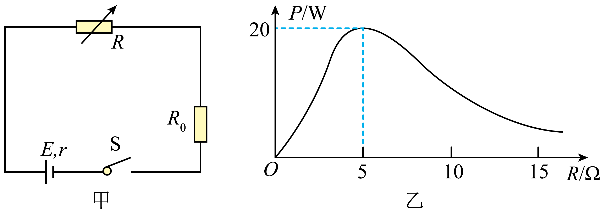

## 讲解

### 判据

看到“最大”“效率”“功率图像”，先给目标加下标：整个外电路P出、某电阻P_R、源效率η。固定E、r且纯电阻条件下，整个外电路P出在R外＝r最大；η随R外增大提高。

若只求串联电阻箱R的功率，R之外的固定电阻要整体记入匹配条件。图乙原题就是这种情况，不能看到峰值R＝5 Ω就说内阻5 Ω。

### 流程

1. **明确功率的电压和电流。** 电阻箱P_R＝I²R，回路I＝E/(R+R₀+r)，得到P_R＝E²R/(R+R₀+r)²。

2. **将固定部分记为a。** a＝R₀+r，分母(R+a)²＝4Ra+(R−a)²。非负平方在R＝a归零，于是可调R的功率最大条件R＝R₀+r。

3. **由峰值倒推参数。** 图给R峰＝5 Ω，减去R₀＝4 Ω得到r＝1 Ω；P峰20 W＝E²/[4×5 Ω]，得到E＝20 V。

4. **重新列效率分子。** 源效率包括两外部电阻，η＝(R+R₀)/(R+R₀+r)，本题9/10＝90%；不能把电阻箱单独得到的功率当作全部输出。

5. **处理范围。** 匹配点不在可调范围内就考察允许区间；“效率最高”若无上限，仅能说趋近100%的极限，同时输出趋近0，不能声称在有限非零负载上恰好100%。

## 例题

> 题目与解析：第十二章 电能能量守恒定律（单元测试·提升卷）（解析版）.docx，来源ID S14，第60—73段。分段选取时保留该子问的完整题干、答案与解析；题目背景和原资料标注照录。

4．如图甲所示，将一电源与阻值$R_0=4\,\Omega$的定值电阻及电阻箱R连接成闭合回路，测得电阻箱所消耗的功率P与电阻箱读数R的关系如图乙所示，则下列说法正确的是（　　）

A．电源内阻$r=5\,\Omega$

B．电源电动势$E=30\,\mathrm V$

C．电阻箱所消耗功率P最大时，电源的效率为90%

D．定值电阻$R_0$的功率最大时，电阻箱的阻值$R=1\,\Omega$

**原资料答案：** C

**原资料详解：** 

A．根据乙图，由电阻箱功率最大的条件可知，此时满足$R=R_0+r$，可知电源内阻

$r=1\,\Omega$，故A错误；

B．由$P_{\max}=\frac{E^2}{4(R_0+r)}$，解得

$E=20\,\mathrm V$，故B错误；

C．电阻箱所消耗功率P最大时，电源效率$\eta=\frac{R+R_0}{R+R_0+r}\times100\%=90\%$，故C正确；

D．由$P=I^2R_0=\left(\frac E{R+r+R_0}\right)^2R_0$可知，当$R=0$时，定值电阻$R_0$功率最大，故D错误。

故选C。

### 顺着本题再看清一步

A把电阻箱峰值位置直接当r，漏R₀而错；B不满足峰值20 W，E应20 V；C把两个外电阻都算输出，得到90%，正确；D定值R₀的功率取决于I²，R归零电流最大，因此原选项1 Ω错误。

## 易错

整个外电路最大功率才对应50%；固定外电阻会改变某一可调元件的峰值；电源效率与单一有用负载效率分母不同。
