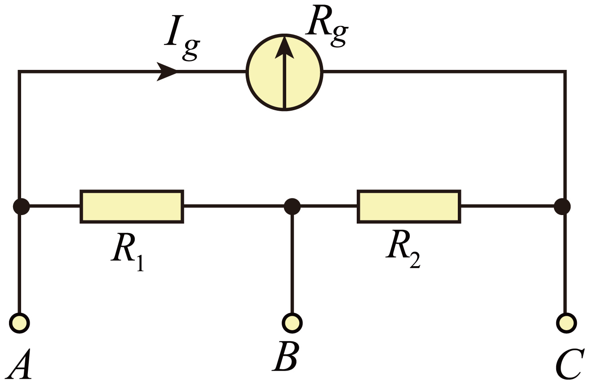

## 讲解

### 判据

表头有内阻Rg和满偏电流Ig，满偏电压Ug＝IgRg。扩电流量程需分流，扩电压量程需分压；目标是总量达到新量程时表头恰满偏，不能让表头本身流过全部大电流。

### 流程

1. **先算表头允许量。** 本题Rg＝20 Ω、Ig＝200 mA＝0.2 A，Ug＝4 V。量程电流式统一用A。
2. **单量程电流表用并联同压。** 若总量程I，分流电阻流I−Ig，列IgRg＝(I−Ig)Rs，得Rs＝IgRg/(I−Ig)。量程更大需Rs更小。
3. **单量程电压表用串联同流。** 若量程U，U＝Ig(Rg+Rv)，得附加Rv＝U/Ig−Rg。不要把总内阻U/Ig当附加电阻。
4. **本题双量程先按接线重判。** A-B间，R₁为分流支路，表头串R₂为另一支路；A-C间，表头与R₁+R₂并联。不同接线不能一直拿同一个Rs。
5. **列两组满偏方程。** A-B量程3 A：0.2(20+R₂)＝(3−0.2)R₁；A-C量程0.6 A：0.2×20＝(0.6−0.2)(R₁+R₂)。第二式给R₁+R₂＝10 Ω，代R₂＝10−R₁到第一式，得6−0.2R₁＝2.8R₁，故R₁＝2 Ω、R₂＝8 Ω。
6. **回代核满偏。** A-B表头支路压0.2×28＝5.6 V，R₁支路2.8×2同为5.6 V；A-C表头4 V、分流0.4×10也4 V。

## 例题

> 题目与解析：第十一章 电路及其应用（单元测试·基础卷）（解析版）.docx，来源ID S06，第49—61段。分段选取时保留该子问的完整题干、答案与解析；题目背景和原资料标注照录。

5．如图所示，某同学将一内阻$R_g=20\,\Omega$满偏电流$I_g=200\,\mathrm{mA}$的表头，改装成双量程电流表。电流从A端流入，电流表有0~0.6A和0~3A两个量程。下列说法正确的是（　　）

A．电阻$R_{2}$的阻值是$R_{1}$的4倍

B．电阻$R_{1}$的阻值是$R_{2}$的5倍

C．接A、B接线柱时，电表量程为0~0.6A

D．接A、C接线柱时，电表量程为0~3A

**原资料答案：** A

**原资料详解：** AB．接A、B接线柱时，有$I_g(R_g+R_2)=(3-I_g)R_1$

接A、C接线柱时，有$I_gR_g=(0.6-I_g)(R_1+R_2)$

联立可得$R_1=2\,\Omega$，$R_2=8\,\Omega$

即$R_2=4R_1$，故B错误，A正确；

CD．并联电阻越小，改装电表量程越大，所以接A、B接线柱时，电表量程为$0\sim3\,\mathrm A$；接A、C接线柱时，电表量程为$0\sim0.6\,\mathrm A$，故CD错误。

故选A。

### 顺着本题再看清一步

A正确，R₂＝4R₁；B写R₁＝5R₂错误；C接A-B实为3 A量程，错；D接A-C实为0.6 A量程，错。每个量程需以“该接线下Ig到满偏时，总电流多大”判断。

单电压表改装的分压推导由串联电路补写，例题仍为资料原双量程电流表，没有另造数值题。

## 易错

表头满偏电流200 mA不能代成200 A；多量程电路有电阻同时兼作分流与串联，不能只看两电阻谁小就忽略串表头的部分。
