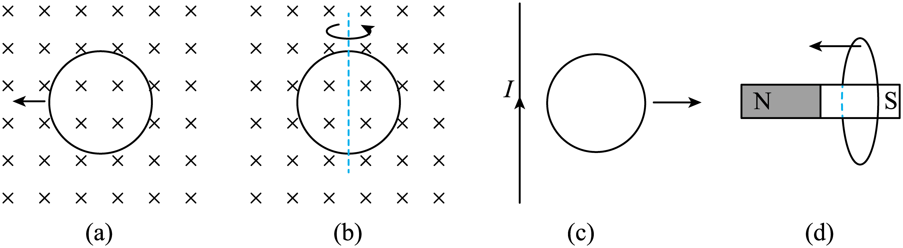

## 错法

把“运动”当充分条件，或把闭合线圈整体平移与一部分导体切割混为一谈。还可能看到闭合回路就在磁场中，忘记问穿过它的量有没有变化。

## 正解

先确认导电路径闭合，再考察整条回路的净磁通量随时间是否变化。完全在匀强场中的刚性闭合框整体平移，B、面积和夹角均不变，Φ不变，不产生本题回路电流。

靠近磁铁或远离恒定电流导线，虽然源磁场不随时间改变，移动回路采到的空间B可以变，Φ就变；绕合适轴转动也可以改角度。若回路开口，有电动势也不能形成持续闭合回路电流。

## 例题

> 题目与解析：第十三章 电磁感应与电磁波初步（专项训练）（解析版）.docx，来源ID S02，第317—328段。分段选取时保留该子问的完整题干、答案与解析；题目背景和原资料标注照录。

29．（2025·北京·高考真题）下列图示情况，金属圆环中不能产生感应电流的是（　　）

A．图（a）中，圆环在匀强磁场中向左平移

B．图（b）中，圆环在匀强磁场中绕轴转动

C．图（c）中，圆环在通有恒定电流的长直导线旁向右平移

D．图（d）中，圆环向条形磁铁N极平移

**原资料答案：** A

**原资料详解：** 

A．圆环在匀强磁场中向左平移，穿过圆环的磁通量不发生变化，金属圆环中不能产生感应电流，故A正确；

B．圆环在匀强磁场中绕轴转动，穿过圆环的磁通量发生变化，金属圆环中能产生感应电流，故B错误；

C．离通有恒定电流的长直导线越远，导线产生的磁感应强度越弱，圆环在通有恒定电流的长直导线旁向右平移，穿过圆环的磁通量发生变化，金属圆环中能产生感应电流，故C错误；

D．根据条形磁铁的磁感应特征可知，圆环向条形磁铁N极平移，穿过圆环的磁通量发生变化，金属圆环中能产生感应电流，故D错误。

故选A 。

### 顺着本题再看清一步

这是“不能产生”的反向选择。A圆环完全处于匀强场内平移，B、面积、夹角都不变，Φ不变，故A符合。B绕图示直径转动改变夹角，Φ变化；C离恒定电流长直导线越来越远，所在处B减弱，Φ变化；D靠近磁铁N极，穿过面积的磁场分布变化，Φ变化，三项均可产生感应电流。

因此恒定磁场不代表运动回路的磁通量一定恒定；导体在动，也不代表闭合回路的净电动势一定不为0。
