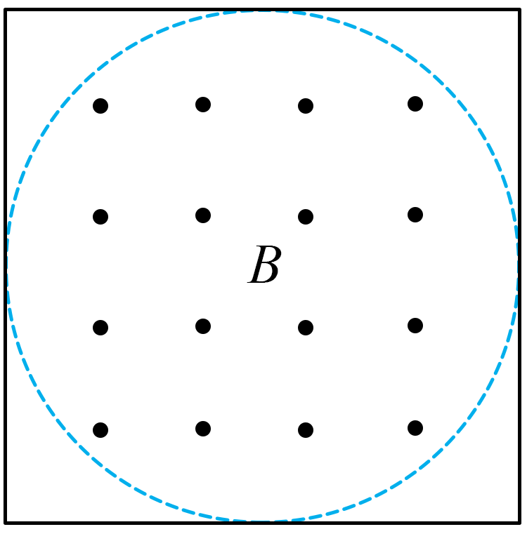

## 错法

看到n匝就把任何磁通量都写成nBS，或见方形线框便用d²，即便只有内部圆形区域有磁场。两个错误分别混淆磁通量与磁通链、几何面积与有效受场面积。

## 正解

先按单匝所围面积计算Φ。相同匝处在相同场中，每匝Φ相同；nΦ记录总磁通链，在整线圈电动势的公式中使用，不能替代Φ。

例题场区是直径d的圆，线框虽是边长d方形，有场面积只有πd²/4；所以Φ＝πBd²/4，与n无关。若不同匝所穿量不同，磁通链应逐匝相加，更不能机械写n乘一个任意Φ。

## 例题

> 题目与解析：第十三章 电磁感应与电磁波初步（专项训练）（解析版）.docx，来源ID S02，第173—178段。分段选取时保留该子问的完整题干、答案与解析；题目背景和原资料标注照录。

17．（24-25高一下·河北邯郸·期末）一边长为d的n匝正方形线框内部有直径为d的圆形匀强磁场，磁场的磁感应强度为B，则穿过线框的磁通量为（　　）

A．$\frac{\pi Bd^2}{4}$

B．$\frac{n\pi Bd^2}{4}$

C．$Bd^2$

D．$nBd^2$

**原资料答案：** A

**原资料详解：** 根据磁通量的定义$\Phi=BS$可知穿过线框的磁通量为$\Phi=\frac{\pi Bd^2}{4}$

故选A。

### 顺着本题再看清一步

圆形磁场直径d，真正有磁场穿过的面积π(d/2)²＝πd²/4，外面方形面积的角部没有B，不能贡献磁通量。A正确；B在正确面积上多乘匝数n，算成磁通链而非磁通量；C用了整个方形面积d²；D同时错用方形面积并多乘n。每匝所穿磁通量相同，不等于单匝磁通量因匝数增加而变大。
