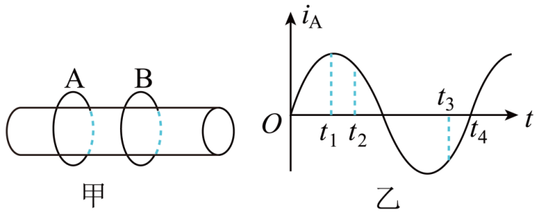

## 错法

看到磁场或通量达到最大，就认为此刻电动势、电流也最大；或者把磁通量变化量与磁通量变化率当成同一个量。图像上，这是把纵坐标的高度误当斜率。

## 正解

法拉第定律求的是变化率：固定回路中$|\mathcal E|=N|d\Phi/dt|$。通量大但变化慢，电动势可以小；在光滑曲线极值点，瞬时斜率为零，电动势为零。只有当斜率绝对值最大，才可能有最大电动势。

本题A环电流决定链接B环的磁通量。$t_1$时A电流最大但变化率零，B没有该时刻的感应电流，所以两环作用力不是最大，A错误。$t_2$时正电流减弱，B产生同向电流；$t_3$时负电流的绝对值减弱，B也产生与当时A同向的电流，两时刻都吸引，B正确。

注意$t_4$时A电流为零，只说明A此刻造成的磁场为零；B的感应电动势仍可因A电流斜率非零而存在。两环相互作用力为零，是因为其中一个环电流为零，不是因为“磁通量为零所以不能感应”。

## 例题

> 题目与解析：第二章 电磁感应（单元测试·基础卷）（解析版）.docx，来源ID S04，第56—63段。分段选取时保留该子问的完整题干、答案与解析；题目背景和原资料标注照录。

6．如图甲所示，AB两绝缘金属环套在同一铁芯上，A环中电流$i_{A}$随时间t的变化规律如图乙所示，下列说法中正确的是（    ）

A．$t_{1}$时刻，两环作用力最大

B．$t_{2}$和$t_{3}$时刻，两环相互吸引

C．$t_{2}$时刻两环相互吸引，$t_{3}$时刻两环相互排斥

D．$t_{3}$和$t_{4}$时刻，两环相互吸引

**原资料答案：** ．B

**原资料详解：** $t_{1}$时刻感应电流为零，故两环作用力为零，则选项A错误；$t_{2}$时刻A环中电流在减小，则B环中产生与A环中同向的电流，故相互吸引，$t_{3}$时刻同理也应相互吸引，故选项B正确，C错误；$t_{4}$时刻A中电流为零，两环无相互作用，选项D错误．

### 顺着本题再看清一步

原解析$t_3$处“电流减小”应理解为电流绝对值减小；图上带符号的负电流实际在增大、向零靠近。采用带符号电流时，不把“数值增加”与“磁场强度增强”混为一谈。
