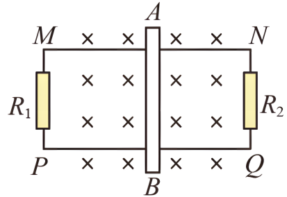

## 讲解

### 是什么

导体在磁场中运动，内部自由电荷随导体运动而受磁场力，出现电荷分离或电流，由此产生的电动势称动生电动势。最常见的直棒模型中，棒长L、速度v、磁场B三者两两垂直，大小为$\mathcal E=BLv$，单位V。

### 怎么来的

对开路直棒，运动载流子受磁场力大小$|q|vB$，正负电荷向不同端积累，棒内形成电场。平衡时电场力抵消磁场力，$|q|E_{\rm 电}=|q|vB$，故$E_{\rm 电}=vB$；均匀电场两端电压$U=E_{\rm 电}L=BLv$。

若棒与导轨构成闭合回路，在时间$\Delta t$内扫过面积$\Delta S=Lv\Delta t$。磁通量变化$\Delta\Phi=B\Delta S$，代入法拉第定律：

$$|\mathcal E|=\frac{|\Delta\Phi|}{\Delta t}=\frac{BLv\Delta t}{\Delta t}=BLv$$

因此动生公式与回路定律一致。闭路中棒相当于电源，若自身电阻为r，端电压一般为$U=\mathcal E-Ir$，不再等于它产生的电动势。

### 什么时候能用

直接使用$BLv$要核对棒在场内的有效长度、磁场方向、速度方向以及是否各处速度相同。一般情形看$\mathbf v\times\mathbf B$在导线方向的分量，不能仅凭“v垂直B”就断言任意方向棒都有$BLv$。

转动棒各点速度不同，需逐段求或用扫过面积计算。匀强静磁场中，同一速度平移的曲线段可等效为端点连线投影；转动时不能同时把全棒长度和端点速度代入。

高中“导体相对磁场切割”的叙述用于题设准静态模型。若磁场随时间变化，还可能有感生电场，不能只靠一个相对速度替代全部电磁作用。能量来自推动棒的外力等机械功；磁场力对单个电荷不做功并不排除导体整体受安培力做功。

## 例题

> 题目与解析：第二章 电磁感应（单元测试·基础卷）（解析版）.docx，来源ID S04，第181—195段。分段选取时保留该子问的完整题干、答案与解析；题目背景和原资料标注照录。

13．如图所示，MN、PQ为光滑金属导轨(金属导轨电阻忽略不计)，MN、PQ相距L=50cm，导体棒AB在两轨道间的电阻为r=1Ω，且可以在MN、PQ上滑动，定值电阻$R_{1}$=3Ω，$R_{2}$=6Ω，整个装置放在磁感应强度为B=1.0T的匀强磁场中，磁场方向垂直于整个导轨平面，现用外力F拉着AB棒向右以v=5m/s速度做匀速运动。求：

(1)导体棒AB产生的感应电动势E和AB棒上的感应电流方向；

(2)导体棒AB两端的电压$U_{AB}$。

**原资料答案：** ．(1)2.5V；感应电流方向B→A；(2)$\frac53$V

**原资料详解：** (1)导体棒AB产生的感应电动势

$E=BLv=2.5\,\mathrm V$

由右手定则，AB棒上的感应电流方向沿B→A方向。

(2)由题意可知，外电路电阻

$R_{\text{并}}=\frac{R_1R_2}{R_1+R_2}=\frac{3\times6}{3+6}\,\Omega=2\,\Omega$

则有

$I=\frac E{R_{\text{并}}+r}=\frac{2.5}{2+1}\,\mathrm A=\frac56\,\mathrm A$

则

$U_{AB}=IR_{\text{并}}=\frac53\,\mathrm V$

## 易错

- 外部两个电阻并联，为2Ω；棒内阻1Ω与其组成总电阻3Ω。
- 电动势2.5V，端电压只有5/3V。忽略棒内阻会把两者误判为相同。
- 棒内等效电源电流B→A；外电路电流从正极A流回负极B，内外方向的说法不能混。
