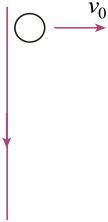

## 讲解

### 是什么

楞次定律给出感应电流的方向：感应电流产生的磁场，总要阻碍引起感应电流的磁通量变化。阻碍的对象是“变化”，不是原磁场本身。回路须闭合才有感应电流；断路时仍可能存在感应电动势。

固定回路取一个正法线，原磁通量为$\Phi$。若原通量沿该正方向增加，感应电流的磁场沿负方向；若原通量沿正方向减少，感应电流的磁场沿正方向。原磁场反向时，应重新判断实际方向和变化，不能只看到$B-t$图斜率负就认定“磁场减弱”。

### 怎么来的

法拉第实验表明通量变化引起感应，楞次定律归纳感应的方向。能量关系能帮助理解：把磁铁向线圈推进时，线圈产生抵抗靠近的作用，外力克服阻碍做功，机械能转化为电能及热。若感应作用反而主动帮助磁铁靠近、又不断发热，却没有其他能源供给，就会违背能量守恒。

这不是“所有电磁力都与物体速度反向”。磁场由外部装置移动时，感应作用可使导体同向跟随，阻碍的是相对运动；具体力仍需由电流和当地磁场用左手定则判断。

### 什么时候能用

先确定回路，再判断穿过该回路的原通量怎样变，最后从所需感应磁场用右手螺旋定则反推电流。“增反减同”适用于原场方向已明确、比较其同方向通量大小增减的场景。

“来拒去留”“增缩减扩”是一些几何条件下的表现，不能代替通量分析。线圈完全处于同一匀强静磁场内匀速平移，通量不变，没有回路感应电流，虽每一边都可能运动切割。实际阻碍能改变运动和通量演变，不能把资料“不会改变最终结果”当成任何情况下都成立的绝对结论。

## 例题

> 题目与解析：第二章 电磁感应（专项训练）（解析版）.docx，来源ID S02，第38—48段。分段选取时保留该子问的完整题干、答案与解析；题目背景和原资料标注照录。

3．（2025·江苏南京·模拟预测）如图所示，有一根竖直向下的长直导线，导线中通有向下的恒定电流，从靠近导线的位置以水平向右的速度抛出一金属圆环，圆环运动过程中始终与导线处于同一竖直面。不计空气阻力，下列说法正确的是（　　）

A．圆环中不会产生感应电流

B．圆环中会产生顺时针方向的电流

C．圆环做平抛运动

D．开始的一段时间内，圆环所受安培力向左

**原资料答案：** D

**原资料详解：** AB．根据右手螺旋定则可知导线右边的磁场方向垂直纸面向外，圆环水平向右的速度抛出，离通电直导线越远，磁感应强度越小，故圆环中的磁通量向外变小，根据楞次定律，可判断出圆环的感应电流为逆时针方向的电流，故AB错误；

C．圆环中有感应电流，而圆环在运动过程中会受到安培力的作用，不再只受重力，所以圆环不做平抛运动，故C错误；

D．开始的一段时间内，圆环中产生逆时针方向的电流，把圆环看成由无数小段电流元组成，根据左手定则，每一小段电流元受到的安培力的合力方向向左，所以圆环所受安培力向左，故D正确。

故选D。

## 易错

- 圆环远离通电直导线，当地向纸外的磁场减弱，因此感应磁场仍向纸外，电流逆时针，并非总与原场反向。
- 圆环除了重力还受磁场力，不能再按只受重力的平抛模型求运动。
- 原解析把不同位置的小段力相加；近导线一侧磁场强，合力向左，阻碍圆环水平远离。
