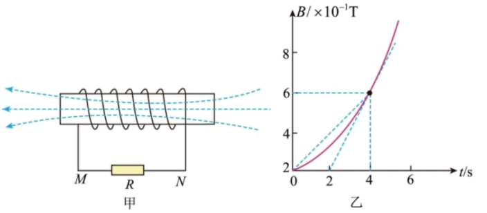

## 讲解

### 是什么

法拉第电磁感应定律描述磁通量变化与感应电动势的关系。电动势表示沿回路每单位电荷获得的能量，单位V，属于带正负约定的标量；不能把它的“方向”理解为普通空间矢量。

固定正法线和对应正绕行方向，$N$匝同样链接磁通量的线圈，时间间隔内平均感应电动势为

$$\overline{\mathcal E}=-N\frac{\Phi_2-\Phi_1}{\Delta t}$$

$\Phi$是每匝磁通量，单位Wb；$N$是匝数；$\Delta t$单位s；$1\,\mathrm{Wb/s}=1\,\mathrm V$。只求大小时取绝对值；负号表达楞次定律的阻碍方向。

### 怎么来的

这是由电磁感应实验归纳的基本规律。对同样受场的串联N匝，每匝电动势相加，故有N倍；不能把已经含匝数的磁链$\Psi=N\Phi$再乘一次N。

匀强磁场下$\Phi=BS\cos\theta$，$\theta$是磁场与面积法线的夹角。因此通量变化既可由$B$改变、面积改变，也可由方向改变。若B和S同时变，直接计算末初差$B_2S_2\cos\theta_2-B_1S_1\cos\theta_1$，不能只乘两个变化量。

瞬时电动势取该时刻通量曲线的变化率，即斜率：$\mathcal E=-N\,d\Phi/dt$。本章例题固定S、法线不变，所以其大小是$NS$乘$B-t$曲线切线斜率大小。

### 什么时候能用

法拉第定律用于确定整个回路电动势；磁通量要对该回路所围面积求。断开的导体仍可按题设回路或补全的几何路径分析电动势，但不能因此宣称断路中存在持续感应电流。

闭合纯电阻电路、可忽略自感等影响时，才接着用$I=\mathcal E/R_{\rm 总}$；有自感、电容或其他电源时，须建立实际电路。感应电动势与外电阻无直接依赖，不等于感应电流与电阻无关。

## 例题

> 题目与解析：第二章 电磁感应（专项训练）（解析版）.docx，来源ID S02，第177—188段。分段选取时保留该子问的完整题干、答案与解析；题目背景和原资料标注照录。

3．（2025·山东·模拟预测）如图所示，一实验小组利用传感器测量通电螺线管的磁场随时间变化的实验规律，测得螺线管的匝数为$n=30$匝、横截面积$S=20{cm}^{2}$，螺线管电阻$r=1Ω$，与螺线管串联的外电阻$R=5Ω$。穿过螺线管的磁场的方向如图甲所示，磁感应强度按图乙所示的规律变化（以磁场方向向左为正方向），则$t=4\,\mathrm{s}$时（　　）

A．通过R的电流方向为M→N

B．通过R的电流为1mA

C．R的电功率为$2\times {10}^{-5}W$

D．螺线管两端M、N间的电势差${U}_{MN}=10mV$

**原资料答案：** C

**原资料解析：** 

A．由乙图可知，通过螺线管的磁通量增大，由楞次定律可知，感应电流产生的磁场方向与原磁场方向相反，结合安培定则可知，通过$R$的电流方向为$N→M$，故A错误；

B．根据法拉第电磁感应定律可知，电路中的感应电动势$E=n\frac{\Delta B⋅S}{\Delta t}=30\times 2\times {10}^{-1}\times 20\times {10}^{-4}V=1.2\times {10}^{-2}V$，结合闭合电路的欧姆定律可得$I=\frac{E}{R+r}=\frac{1.2\times {10}^{-2}}{5+1}A=2mA$，故B错误；

C．根据$P={I}^{2}R$，代入数据解得定值电阻的电功率为$P={(2\times {10}^{-3})}^{2}\times 5W=2\times {10}^{-5}W$，故C正确；

D．根据楞次定律判断螺线管$N$端等效于电源正极，欧姆定律可得螺线管两端$M、N$间的电势差${U}_{MN}=-IR=-2\times 5mV=-10mV$，故D错误。

故选C。

### 顺着本题再看清一步

由切线斜率求电动势0.012V，再除总电阻得2mA。A的方向错、B少算一倍、D漏负号；C用外电阻5Ω计算电功率，得$2\times10^{-5}\,\mathrm W$。原题已有逐项解析，计算对象“电动势/端电压/外电阻功率”需始终分开。

## 易错

- $t=4\,\mathrm s$的瞬时变化率取切线斜率$0.2\,\mathrm{T/s}$，不是$B(4)/4$或图上B的高度。
- $20\,\mathrm{cm^2}=20\times10^{-4}\,\mathrm{m^2}$，不能按长度换算比例处理面积。
- 本题线圈有1Ω内阻，电流用总电阻6Ω；MN端电压为$-10\,\mathrm{mV}$，符号需与原图极性一致。
