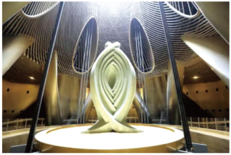

## 讲解

### 是什么

块状导体中存在许多内部闭合电流路径，变化的磁通量可沿这些路径产生环绕流动的感应电流，称涡流。无需把金属板另外接一条外部闭合导线；金属自身就提供导电路径。

涡流属于电磁感应，伴有电阻发热，并可与磁场作用产生阻尼或驱动力。它不是仅凭“有磁场”就发生：静止金属处于不变的磁场内，或全体刚性匀速平移于同一无限匀强静磁场内，并不会因此持续产生涡流。

### 怎么来的

选金属内部一个闭合小回路，若通量变化，法拉第定律给出回路电动势；电荷在导体中定向移动形成电流。该路径有电阻，就把电能以焦耳热形式转为内能。对等效小回路，有$P=I^2R$；若电动势既定，代$I=\mathcal E/R$得到

$$P=\frac{\mathcal E^2}{R}$$

所以同一激励和可比回路中，降低电阻常使电流及发热增大。实际金属板有分布电流，不能把整块板不加说明当成单个确定电阻的线圈。

金属进出非均匀磁场时，机械能可转为电能并最终变成内能；电磁炉、冶炼炉中，电源提供变化磁场，向金属传递能量。无需把热归因于“磁场对电荷做功”。

### 什么时候能用

电磁阻尼利用涡流减少相对运动，电磁加热利用它发热。若需降低铁芯涡流损耗，可使用电阻率较高的材料，并把铁芯做成相互绝缘的薄片，阻断大面积导电回路。薄片间必须绝缘；仅把完整导体切成片后紧密导电接触，不能达到同样效果。

“变化快、回路面积大、电阻率低，涡流较强”只作其他条件相同、简化模型的比较；高频下还可能有集肤和磁场反作用，不能无条件照此预测所有装置的电流。

## 例题

> 题目与解析：第二章 电磁感应（复习讲义）（解析版）.docx，来源ID S12，第267—276段。分段选取时保留该子问的完整题干、答案与解析；题目背景和原资料标注照录。

【变式5】（2025·江苏徐州·二模）台风“贝碧嘉”登陆上海，中国自主研发的千吨阻尼器——“上海慧眼”（如图所示）摆动明显，保障了上海中心大厦的安全。“上海慧眼”采用了电涡流阻尼技术，永磁体形成的磁场与质量块一起摆动时，与其下方固定的导体板产生相对运动，从而在导体板中产生电涡流。关于该阻尼器，下列说法正确的是（　　）

A．阻尼器的电涡流阻尼技术原理是电流的磁效应

B．振动稳定时，阻尼器的振动频率小于大厦的振动频率

C．阻尼器将机械能最终转化为内能

D．若将阻尼器下方的导体板换成木地板，对使用效果没有影响

**原资料答案：** C

**原资料解析：** 

B．阻尼器受迫振动，稳定时阻尼器的振动频率与大厦的振动频率相等，故B错误；

ACD．根据电磁感应原理可知，永磁体通过导体板上方时会在导体板中产生电涡流，阻碍永磁体相对导体板的运动，将机械能最终转化为内能，若将阻尼器下方的导体板换成绝缘的木地板，将不会产生电涡流，影响使用效果，故AD错误，C正确。

故选C。

## 易错

- A把涡流的产生原因说成电流磁效应，漏掉“变化磁通量→感应电流”；电流磁效应只描述电流又能产生磁场。
- B中稳定受迫振动频率与大厦激励频率相同；“稳定”不等于回到阻尼器自己的固有频率。
- 木板不能提供相应涡流回路，D错误；机械能最终转为内能，C正确。
