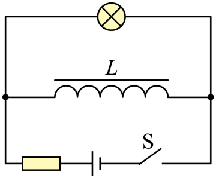
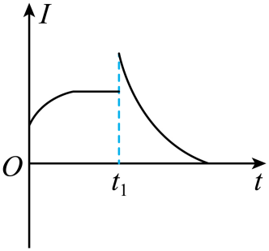
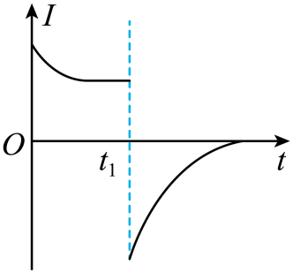
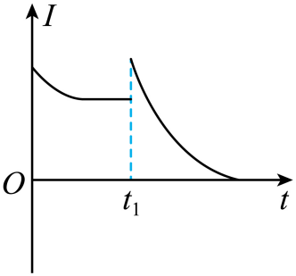
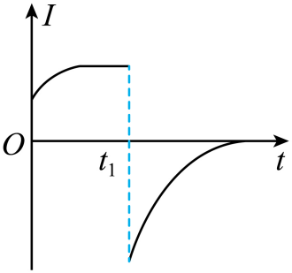

## 讲解

### 判据

线圈自感系数大、开关突然接通或断开、灯亮暗变化或电流图像，核心是“线圈电流连续，电路连接改变”。线圈直流电阻和自感系数是两件事：前者决定稳态分流，后者影响过渡过程。

### 流程

1. 画通电前、刚通电、稳定后和刚断电四张连接关系。不是每一根原有导线都在断电后继续接通，先找线圈是否能经灯泡形成闭合放电回路。
2. 零初始电流时，刚闭合线圈电流仍近似零；此时线圈所在支路可近似开路。电流先走可导通的其他支路，灯是否立即亮按实际电源连接判断。
3. 足够久后电流不变，自感电动势为零，线圈等效其直流电阻$R_L$。用普通直流分流关系求$I_{L0}$和灯电流$I_{A0}$；$R_L$很小才可近似短路。
4. 断开时，线圈电流先保持$I_{L0}$及原方向。在线圈与灯的剩余串联回路中，灯电流由它决定，可能与原灯电流反向并发生跳变。
5. 比较刚断电灯电流大小与断电前的灯电流。若$I_{L0}>I_{A0}$，电功率会先增大，有闪亮条件；相等时无电流大小增大，小于时不能判为更亮。灯的热惯性使视觉亮度并非数学上立即跳变，题目按教材现象模型分析。
6. 随磁场能释放，放电回路电流连续减小至零。图像方向用正负号表示，不能只画绝对值就把反向抹掉。

若切断所有导电路径，自感可能产生高压与电弧；没有放电回路的灯不能凭“有自感”就发亮。

## 例题

> 题目与解析：第二章 电磁感应（专项训练）（解析版）.docx，来源ID S02，第213—219段。分段选取时保留该子问的完整题干、答案与解析；题目背景和原资料标注照录。

6．（24-25高二下·广东·阶段练习）在如图所示的电路中，电源的电动势为$E$、内阻为$r$，线圈的自感系数很大，线圈的直流电阻${R}_{L}$小于灯泡的电阻$R$。在$t=0$时刻闭合开关S，经过一段时间后，在$t={t}_{1}$时刻断开S。下列选项中，通过灯泡的电流随时间变化的图像可能正确的是（　　）

A．

B．

C．

D．

**原资料答案：** B

**原资料解析：** 在$t=0$时刻闭合开关S，由于线圈产生自感电动势阻碍通过线圈电流的增大，所以灯泡与电源构成回路，灯泡马上有电流，之后随着通过线圈的电流的增大，通过灯泡的电流逐渐减小；稳定时，由于线圈的直流电阻${R}_{L}$小于灯泡的电阻$R$，所以通过线圈的电流大于通过灯泡的电流，在$t={t}_{1}$时刻断开S，由于线圈产生自感电动势阻碍通过线圈电流的减小，且与灯泡构成回路，所以灯泡的电流突变为原来线圈的电流，方向与灯泡原电流方向相反，且电流逐渐减小为0。

故选B。

## 易错

- 本题灯与线圈并联，断电后成为同一放电回路，灯电流反向；正确图B跃到负值后趋零。
- 稳态$R_L<R$，保证线圈电流大于灯电流，反向跳变的绝对值才更大。
- A、C未画出灯电流反向；D在通电时把灯电流画成逐渐增大，均与电路不符。
