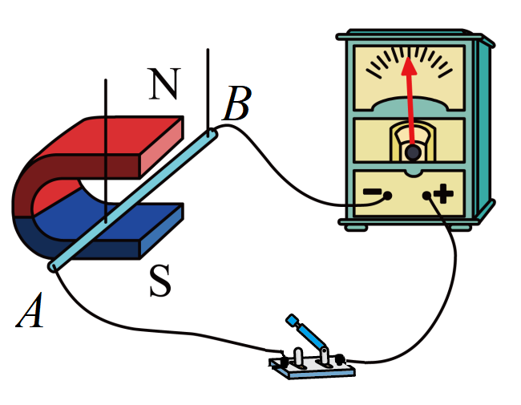

## 讲解

### 判据

先看是否闭合，再看回路净磁通量是否随时间变。题目只说“导体运动”“磁铁存在”“电流恒定”都不足以单独判有无。

图示磁生电实验，开关闭合保证回路条件，导体水平移动改变扫过的有效受场面积；竖直沿磁场移动不改变穿过量。

### 流程

1. **沿导线查闭合。** A、B开关断开，持续回路不成立，无论导体怎样运动都没有本题电流表中的回路电流。开路仍可有电荷分离、电动势，不能一并否定。

2. **读B和运动的空间关系。** 磁场在N到S之间向下，闭合时导体竖直上下运动沿场方向，不切割，C不能使电表偏转。

3. **看实际扫过面积。** 水平左右移动是图示部分导体相对其余回路运动，切割磁场、改变回路受场面积，所以D可以偏转。

4. **区分部分运动与整体平移。** 若整个闭合框完全在匀强场中同速平移，各边贡献可能抵消、Φ不变；不能把D的结论套到任何整体运动。

5. **分时间阶段。** 另一电路接通或断开瞬间磁场改变；接通后恒定状态Φ可不再变化。先认“瞬间/过程中/稳定后”再判。

## 例题

> 题目与解析：第十三章 电磁感应与电磁波初步（单元测试·基础卷）（解析版）.docx，来源ID S06，第30—41段。分段选取时保留该子问的完整题干、答案与解析；题目背景和原资料标注照录。

4．如图，在探究磁生电实验中，下列做法能使电流表指针发生偏转的是（　　）

A．断开开关，导体AB竖直上下运动

B．断开开关，导体AB水平左右运动

C．闭合开关，导体AB竖直上下运动

D．闭合开关，导体AB水平左右运动

**原资料答案：** D

**原资料详解：** 电磁感应实验中，闭合电路的部分导体做切割磁感线运动，电路中有感应电流，能使电流表指针发生偏转。

AB．断开开关，不能构成闭合电路，导体AB无论怎样运动都不能产生感应电流，故AB不符合题意；

C．闭合开关，导体AB竖直上下运动，不切割磁感线，不能产生感应电流，故C不符合题意；

D．闭合开关，导体AB水平左右运动，切割磁感线，能产生感应电流，故D符合题意。

故选D。

### 顺着本题再看清一步

A、B首先被开路条件排除，C再被不切割且不改变回路磁通排除，D同时满足闭合与磁通变化，因此答案D。磁感线是假想线，“切割”是几何判据，物理上不需要导体碰到实际细线。

## 易错

电路闭合只是必要条件之一；开路无电流不等于无电动势；整体平移与单棒相对回路运动不同。
