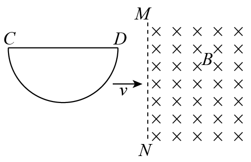

## 讲解

### 判据

“某时刻”“最大值”求瞬时电动势；“从开始到结束”“该过程平均值”用整个时间间隔的通量变化率。瞬时值看曲线切线斜率，平均值看两端连线斜率。磁场或有效长度非恒定时，这两种斜率通常不同。

### 流程

1. 先标明回路和计算时段，确定每匝通量$\Phi$及匝数N。保持同一正法线，不用前后磁场大小的无符号差替代有向通量差。
2. 平均电动势取$\overline{\mathcal E}=-N(\Phi_2-\Phi_1)/\Delta t$。若电动势变号，得到的是有符号平均；要平均大小，必须分段求$|\mathcal E|$的时间平均，不能把末初差取绝对值就结束。
3. 瞬时值取$\mathcal E=-N\,d\Phi/dt$。直棒平移的适当几何下用$BLv$；弯线进入磁场时，L是该时刻边界截得的有效切割长度，会随位置变化。
4. 最大值找变化率绝对值最大的位置，不是通量最大的位置。半圆进入本题磁场时，边界与半圆相交的竖直长度从0增到a再减到0，所以最大瞬时电动势是Bav。
5. 求本题平均值时，通量总增量为$B\pi a^2/2$，全程横向位移是直径$2a$，时间$2a/v$，因此

$$|\overline{\mathcal E}|=\frac{B\pi a^2/2}{2a/v}=\frac{\pi Bav}{4}$$

该过程方向不变，所以有符号平均的大小恰好等于平均大小。若用最大切割长度a乘v，只得到峰值，不能当平均。

最后检查平均大小是否不超过最大值：$\pi/4<1$，本题两结果相容。

## 例题

> 题目与解析：第二章 电磁感应（单元测试·基础卷）（解析版）.docx，来源ID S04，第114—125段。分段选取时保留该子问的完整题干、答案与解析；题目背景和原资料标注照录。

10．如图所示，一导线弯成半径为a的半圆形闭合回路．虚线MN右侧有磁感应强度为B的匀强磁场．方向垂直于回路所在的平面．回路以速度v向右匀速进入磁场，直径CD始终与MN垂直．从D点到达边界开始到C点进入磁场为止，下列结论正确的是（    ）

A．感应电流方向不变

B．CD段直线始终不受安培力

C．感应电动势最大值E＝Bav

D．感应电动势平均值$\bar E=\frac14\pi Bav$

**原资料答案：** ．ACD

**原资料详解：** 

A．在闭合电路进入磁场的过程中，通过闭合电路的磁通量逐渐增大，根据楞次定律可知感应电流的方向为逆时针方向不变，A正确；

B．根据左手定则可以判断，受安培力向下，故B错误；

C．当半圆闭合回路进入磁场一半时，即这时等效长度最大为a，这时感应电动势最大$E=Bav$，C正确；

D．由法拉第电磁感应定律可得感应电动势平均值$\bar E=\frac{\Delta\Phi}{\Delta t}=\frac{B\cdot\frac12\pi a^2}{2a/v}=\frac14\pi Bav$，故D正确．

【点睛】由楞次定律可判断电流方向，由左手定则可得出安培力的方向；由$E=BLv$，分析过程中最长的L可知最大电动势；由法拉第电磁感应定律可得出电动势的平均值．

## 易错

- 半圆线框此图从右端D开始进入，完整进入用时$2a/v$，不是$a/v$。
- CD直段虽平行速度、不产生沿自身方向的动生电动势，但有回路电流且电流垂直B，仍受向下安培力，B错误。
- 在理想锐利边界刚开始或刚结束的孤立时刻，切割长度为零；题目“方向不变”讨论有电流的进入过程。
