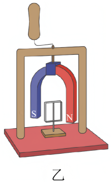
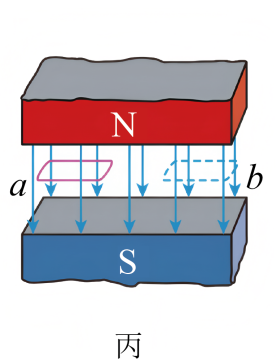
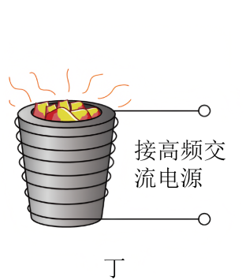

## 讲解

### 判据

金属块在变化磁场中发热，看涡流热效应；磁体相对导体转动，导体被带动，看电磁驱动；金属与磁场相对运动受阻，看电磁阻尼。三者都要先有内部感应电流，再讨论热或力的结果。

### 流程

1. 先问磁通量为何变化：外电源使磁场随时间变化，或导体/磁体相对运动使内部回路经历不同磁场。仅置于静磁场中，不够产生持续涡流。
2. 金属是否能形成闭合导电路径？整块导体可以，绝缘木板不可以。绕线线圈完全处于匀强磁场中作刚性平移，则总通量不变，不能误用“每段都切割”认定回路有电流。
3. 若主要观察温度升高，说明电流电阻损耗$P=I^2R$把能量变为内能。感应冶炼的能量来自高频电源；不要把加热描述成磁场直接对电荷做功。
4. 若观察导体随转动磁体同向转，感应作用在减小相对运动。导体一般比磁体慢，持续保持相对变化和驱动力；在资料这个理想模型中两者达到同速后没有持续感应驱动力，不能说它必定永远同速转。
5. 若观察运动衰减，检查能量从机械能向热的转移。阻尼针对产生感应的相对运动，外部磁体转动时可以驱动静止导体，力不总与导体相对地面的速度反向。
6. 若问降低损耗，增大材料电阻率或将铁芯分成相互绝缘薄片，减少大回路电流；若问强化加热，则须按器材条件改变频率与磁通变化，不能只把“电阻小”作为所有频率的绝对规则。

## 例题

> 题目与解析：第二章 电磁感应（复习讲义）（解析版）.docx，来源ID S12，第255—266段。分段选取时保留该子问的完整题干、答案与解析；题目背景和原资料标注照录。

【例5】（24-25高二下·河南商丘·期中）关于下列四幅图的说法正确的是（　　）

     

    

    

A．图甲中小磁针放在超导环形电流中间，静止时小磁针的指向如图甲所示

B．摇动图乙中的手柄使得蹄形磁铁转动，则铝框会以相同的速度同向转动

C．将图丙中金属矩形线框从匀强磁场中的a位置水平移到b位置，框内会产生感应电流

D．图丁是真空冶炼炉，当炉外线圈通入高频交流电时，炉内金属产生涡流发热，从而冶炼金属

**原资料答案：** D

**原资料解析：** 

A．根据安培定则可知，环形电流在环内的磁场方向垂直于纸面向外，则静止时小磁针的$N$极应该向外，不是如图甲所示，故A错误；

B．摇动图乙中的手柄使得蹄形磁铁转动，导致穿过铝框的磁通量发生变化，铝框产生感应电流，根据楞次定律可知，蹄形磁铁的磁场对感应电流的安培力使得铝框以小于蹄形磁铁转动的速度同向转动，故B错误；

C．将图丙中金属矩形线框从匀强磁场中的$a$位置水平移到$b$位置，穿过线框的磁通量没有发生变化，框内不会产生感应电流，故C错误；

D．图丁是真空冶炼炉，当炉外线圈通入高频交流电时，炉内金属产生涡流发热，从而冶炼金属，故D正确。

故选D。

## 易错

- A是电流磁场方向判断，用右手螺旋定则得环内场向外，不能按图中小磁针指纸面右方。
- B混淆同向与同速：铝框同向跟随，但比磁体转得慢，才持续有相对运动。
- C全框在同一匀强磁场中平移，磁通量不变；D变化磁场在金属中产生涡流发热，正确。
