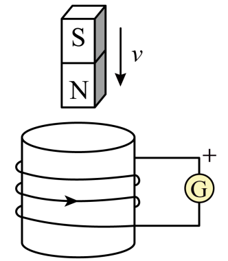

## 讲解

### 判据

题目涉及磁铁靠近/离开、线圈面积变化、磁场强弱变化，且要判断感应电流、磁极或指针方向，使用楞次定律。先明确回路是否闭合，再考虑通量变化；“有磁铁”“有相对运动”都不能单独保证有回路电流。

### 流程

1. 确定所研究回路及观察方向。纸面内电流顺逆时针从哪一侧看要固定；螺线管还需沿实际绕线从一端追踪到另一端。
2. 找回路处原磁场。磁铁外部磁感线由N到S；通电直导线的场用右手螺旋定则。在磁铁下方和上方观察，同一个极名未必对应同一个空间方向。
3. 判断穿过回路的磁通量增减。磁铁未进入线圈也可能改变通量；只旋转不改变$BS\cos\theta$则没有回路感应电流。
4. 用“阻碍变化”定感应磁场。原场同方向通量增加就反向；减少就同向。若原场跨零反向，要保持法线约定，按有向通量变化判断，避免在零点机械翻转电流。
5. 用右手螺旋定则，从感应磁场反推线圈绕行方向，然后沿导线追到电流计接线柱。指针怎样偏需题干给出或实验预先标定，不从“正接线柱在右边”直接猜。
6. 检查改变绕线方向后，所需感应磁场不变，但同一接线条件下端子电流可反向。这里改变的是实现该磁场所需的绕行关系，不是楞次定律本身。

若题目还问导线受力，先完成上述电流判断，再用左手定则；三个“手”的用处不能相互替代。

## 例题

> 题目与解析：第二章 电磁感应（专项训练）（解析版）.docx，来源ID S02，第26—36段。分段选取时保留该子问的完整题干、答案与解析；题目背景和原资料标注照录。

2．（2025·北京海淀·三模）如图所示，闭合线圈上方有一竖直放置的条形磁铁。“+”为灵敏电流计G的正接线柱位置，电流从“+”流入电流计时指针向右偏转。当磁铁向下运动（但未插入线圈内部）时，线圈中（　　）

A．感应电流的方向与图中箭头方向相反，电流表指针向左偏

B．感应电流的方向与图中箭头方向同，电流表指针向右偏

C．仅改变线圈的绕向，线圈中感应电流的磁场方向也会改变

D．仅改变线圈的绕向，流入电流计的电流方向也会改变

**原资料答案：** D

**原资料解析：** AB．线圈所在处的磁场方向竖直向下；磁铁向下运动，线圈的磁通量增大，根据楞次定律，感应电流的磁场方向竖直向上；根据安培定则，感应电流的方向与图示方向相同；电流从“+”流出电流计，指针向左偏转。AB错误；

C．仅改变线圈的绕向，线圈所在处的磁场方向竖直向下；磁铁向下运动，线圈的磁通量增大，根据楞次定律，感应电流的磁场方向竖直向上；线圈中感应电流的磁场方向不变，C错误；

D．仅改变线圈的绕向，线圈所在处的磁场方向竖直向下；磁铁向下运动，线圈的磁通量增大，根据楞次定律，感应电流的磁场方向竖直向上；根据安培定则，电流从“+”流入电流计，电流方向发生改变。D正确。

故选D。

## 易错

- 本题N极靠近，向下通量增加，感应磁场向上；原图电流箭头正确，但电流计正端流出，指针向左，A、B各错一部分。
- 改绕线不会改变抵抗向下通量增加所需的向上感应磁场，C错误；端子电流反向，D正确。
- “尚未插入线圈”不等于通量不变。
