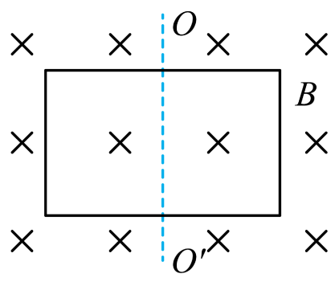

## 讲解

### 判据

给B、面积、角度、线框转动或进出边界，先计算每个状态的有符号Φ，再末减初。要求变化量大小时最后取绝对值；不能一开始抹掉首末方向。

平面角用sin、法线角用cos；磁场有限区域要先求线框投影与场区重叠的面积。多匝数不乘入单匝Φ。

### 流程

1. **固定取向。** 本题初位置法线沿B为正，初通量BS；翻转时跟踪同一线框法线，不每次重新规定正向。

2. **把转角换成法线夹角。** 初法线平行B，转60°后法线与B也是60°，得BS/2；转90°得0；转180°法线反平行，得−BS。

3. **最后末减初。** 180°过程ΔΦ＝−BS−BS＝−2BS，大小2BS，不是0。

4. **做边界核对。** 匀强场整面受场时|Φ|不超过BS；平面平行场时为0。若有部分区域场，不能对无场区域继续加BS；若B、S一起变，分别算首末后相减，不随便用ΔB×ΔS。

## 例题

> 题目与解析：第十三章 电磁感应与电磁波初步（单元测试·提升卷）（解析版）.docx，来源ID S10，第54—69段。分段选取时保留该子问的完整题干、答案与解析；题目背景和原资料标注照录。

5．如图所示，框架面积为S，框架平面与磁感应强度为B的匀强磁场方向垂直，则下列有关穿过平面的磁通量的情况表述正确的是（　　）

A．磁通量有正负，所以是矢量

B．若使框架绕$OO'$转过60°角，磁通量为$BS$

C．若框架从初始位置绕$OO'$转过90°角，磁通量为0

D．若框架从初始位置绕$OO'$转过180°角，磁通量变化量为0

**原资料答案：** C

**原资料详解：** 

A．磁通量有正负，但磁通量是标量，故A错误；

B．使框架绕OO′转过60°角，磁通量为

$\Phi$=BScos60°=$\frac12$BS

故B错误；

C．若框架从初始位置绕OO′转过90°角，线圈平面与磁场平行，磁通量为0，故C正确；

D．若框架从初始位置绕OO′转过180°角，磁通量变化量为

$\Delta\Phi=-2BS$

故D错误。

故选C。

### 顺着本题再看清一步

A错，Φ的正负按同一随线框取定的法线记录，不使它成为矢量。初位置法线沿B取正，Φ₀＝BS；转60°，法线与B夹角60°，Φ＝BS/2，B的BS错；转90°得0，C正确。转180°法线反向，Φ末＝−BS，因此ΔΦ＝−BS−BS＝−2BS；D把首末绝对值相同误当变化量0。

## 易错

首末都为BS大小并不代表通量不变；法线要保持同一取向；ΔΦ是有符号量，题目问大小再取绝对值。
