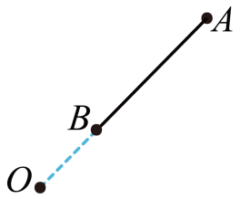

## 讲解

### 判据

直棒斜放、曲线导体运动、导体绕轴旋转时，先核对运动电荷的磁场力在导线方向有没有分量。只有有效切割方向明确后，才取L和v。转动棒各点速度不同，不能选最外端速度代替整段。

### 流程

1. 画出磁场B、导体局部运动速度v和导线方向。在匀强静磁场中，电动势取$\mathbf v\times\mathbf B$沿导体的作用；三者互相垂直时，直棒才直接得到$BLv$。
2. 同一速度平移的导体，在同一匀强磁场内，可把各段电动势相加，用端点连线在切割方向的投影。只在场内的部分参与计算，多个感应源必须按同一绕行方向带符号相加。
3. 转动棒绕轴垂直于B时，距轴x处速度$\omega x$。在同一侧半径$r_1$到$r_2$的一小段$dx$上，电动势为$B\omega x\,dx$；把各小段相加，结果是

$$|\mathcal E|=\frac12B\omega(r_2^2-r_1^2)$$

也可用时间$\Delta t$内扫过的环扇形面积$\Delta S=(r_2^2-r_1^2)\omega\Delta t/2$，代法拉第定律得同式。无需掌握积分也能从扫面积理解平方差的来源。
4. 本题$OB=R$、$BA=2R$且O、B、A依次同一直线，所以$OA=3R$。代$r_1=R$、$r_2=3R$，得$\mathcal E=B\omega(9R^2-R^2)/2=4B\omega R^2$，选C。
5. 若轴在棒中间，两侧到轴的电动势都由同类径向作用形成，求两外端电压要取两侧贡献之差；不要把两侧绝对值盲目相加。问极性还要给定B与转向，不能只凭电压大小判断正端。

有电流时端电压还需扣除内部电阻压降。本题问开路两端电势差大小，按动生电动势计算。

## 例题

> 题目与解析：第二章 电磁感应（单元测试·基础卷）（解析版）.docx，来源ID S04，第14—21段。分段选取时保留该子问的完整题干、答案与解析；题目背景和原资料标注照录。

2．如图所示，导体AB的长为2R，绕O点以角速度ω匀速转动，OB为R，且OBA三点在一条直线上，有一磁感应强度为B的匀强磁场充满转动平面且与转动平面垂直（未画出），那么A、B两端的电势差为（    ）

A．$\frac12BωR^{2}$

B．3$BωR^{2}$

C．4$BωR^{2}$

D．6$BωR^{2}$

**原资料答案：** C

**原资料详解：** AB两端的电势差大小等于金属棒AB中感应电动势的大小，为

$E=B\cdot2R\frac{\omega R+\omega\cdot3R}{2}=4BR^2\omega$

ABD错误，C正确。

故选C。

## 易错

- 棒长2R不是转轴到A的距离；A的半径为3R，B的半径为R。
- 两端速度平均是$2\omega R$；本题v随沿棒位置线性变化，才可用这一平均乘长度，不能推广到任意速度分布。
- 原题文字提取把$R^2$写成R2，已按DOCX公式图规范为平方；不把2当作与R相乘。
