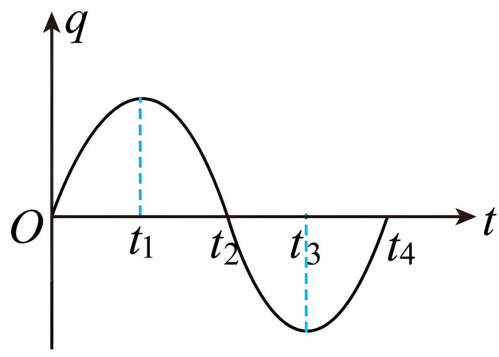
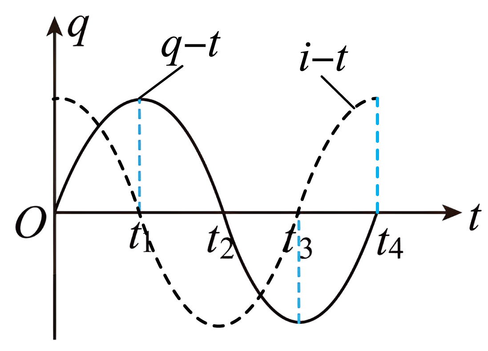

## 错法

觉得充电越多驱动力越强，电流也该越大；或者把q曲线的高度当成电流曲线高度。错误发生在把“目前储存电荷多”与“电荷变化快”混为一谈。

## 正解

选定某板与流入方向，电流为 $i=\mathrm dq/\mathrm dt$，读q曲线斜率而非高度。电荷绝对值最大处为极值，斜率为零，电流零；q过零时斜率绝对值最大，电流最大。

能量也验证：$W_E=q^2/(2C)$、$W_B=Li^2/2$，总能量固定，最大电荷对应全部电场能，最大电流对应全部磁场能。q、i错开T/4，平方能量的周期却是T/2。

## 例题

> 题目与解析：第四章 电磁振荡与电磁波（专项训练）（解析版）.docx，来源ID S02，第207—220段。分段选取时保留该子问的完整题干、答案与解析；题目背景和原资料标注照录。

10.（25-26高二下·全国·课后作业）（多选题）如图所示为LC振荡电路中电容器两极板上的电荷量q随时间t变化的图线，由图可知（　　）

A．在$t_{1}$时刻，电路中的磁场能最小

B．$t_{1}$到$t_{2}$电路中的电流值不断变小

C．从$t_{2}$到$t_{3}$电容器不断充电

D．在$t_{4}$时刻，电容器的电场能最小

**原资料答案：** ACD

**原资料解析：** 由题意可知作出i-t图线（如图虚线所示）

A．在$t_{1}$时刻，电路中的电荷量q最大，电路中电流最小，则磁场能最小，故A正确；

B．在$t_{1}$到$t_{2}$时刻电路中的q不断减小，说明电容器不断放电，电路中的电流值不断增加，故B错误；

C．在$t_{2}$到$t_{3}$时刻电路中的q不断增加，说明电容器在不断充电，故C正确；

D．在$t_{4}$时刻电路中的q等于0，说明电容器放电完毕，则电容器电场能最小，故D正确。

故选ACD。

### 顺着本题再看清一步

t₁处q正峰，电流零、磁场能最小，A正确；t₁到t₂斜率绝对值增大、电流大小增大，B错误；t₂到t₃负电荷绝对值增大，为反向充电，C正确；t₄处q=0、电场能最小，D正确。原解析“q增加”在负区间按绝对值理解。
