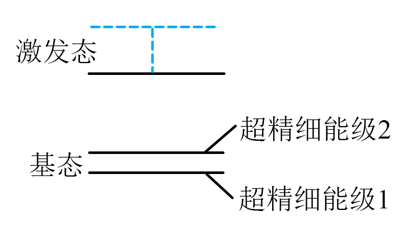

## 错法

把c＝λf中的λ想成固定，认为f增大必使c增大；或把“单光子能量更高”误解成“传播更快”。错误在把真空中彼此相关的λ、f当独立可随意指定。

## 正解

真空电磁波速度由真空传播规律给出c，不随波段频率改变。频率增大时λ＝c/f减小，λf仍为c。光子能量hν增大是每个量子携带能量多，与真空传播速度不是同一性质。

本题铯跃迁f约9.2 GHz，比可见光频率低、波长约3 cm，但真空速度仍与可见光相同。若讨论介质波速，先按该介质模型给v，不能反过来用真空结论保证全部介质同速。

## 例题

> 题目与解析：第十三章 电磁感应与电磁波初步（单元测试·提升卷）（解析版）.docx，来源ID S10，第83—97段。分段选取时保留该子问的完整题干、答案与解析；题目背景和原资料标注照录。

7．如图所示，铯133原子基态有两个超精细能级，国际计量大会将铯133原子基态超精细能级间跃迁对应辐射电磁波的9192631770个周期所持续的时间定为1秒。已知可见光波长范围为400nm~700nm，光速为$3\times10^8\,\mathrm{m/s}$，则（　　）

A．秒在国际单位制中是个导出单位

B．该跃迁辐射出的电磁波波长在可见光波长范围内

C．该跃迁辐射出的电磁波频率比可见光的频率低

D．该跃迁辐射出的电磁波在真空中传播比光速小

**原资料答案：** C

**原资料详解：** 

A．秒在国际单位中是基本单位，故A错误；

BC．铯133原子基态超精细能级间跃迁对应辐射电磁波的频率约为$9.2\times10^9\,\mathrm{Hz}$，根据

$\lambda f=c$

可得其波长约为

$\lambda$=$0.03\,\mathrm m$

波长大于可见光波长，频率低于可见光的频率，故B错误，C正确；

D．电磁波在真空中传播速度等于光速，故D错误。

故选C。

### 顺着本题再看清一步

“9192631770个周期为1秒”意味着f＝9192631770 Hz，约9.2 GHz，不是周期9.2×10⁹ s。真空λ＝c/f≈0.0326 m，原解析0.03 m为近似值；可见光400—700 nm约(4—7)×10⁻⁷ m，相比之下本题波长大很多、频率低很多。

A错，秒是SI基本单位；B错，3厘米量级不是可见光；C正确，频率低于可见光；D错，虽然频率不同，真空传播速度仍为c。这不是原子实际运动的速度。
