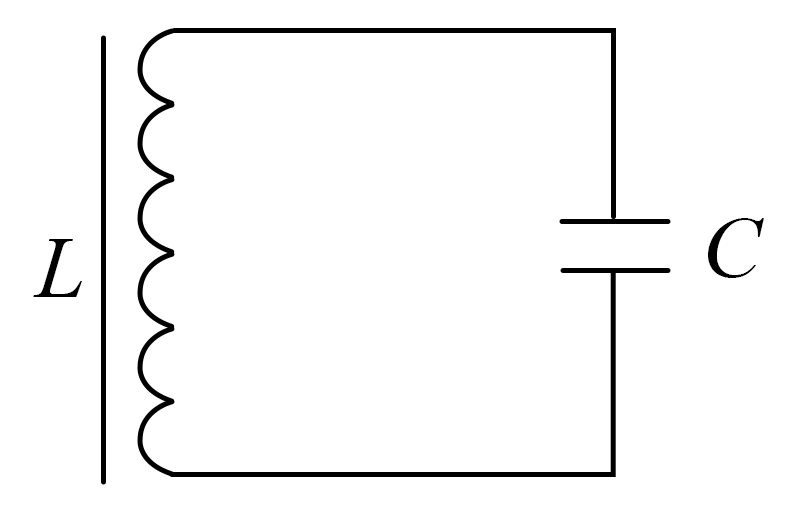

## 讲解

### 是什么

固有周期 $T$ 是无损、无外界驱动LC回路恢复同样电荷与电流状态的时间，单位s；固有频率 $f=1/T$，单位Hz。它取决于 $L$（H）和 $C$（F），不由初始充电电压或电荷量决定。

### 怎么来的

选择某极板电荷为 $q$，并将流入它的电流取正，故 $i=\mathrm dq/\mathrm dt$。理想回路的电压约束为 $L\,\mathrm di/\mathrm dt+q/C=0$。代入电流定义，得到

$$\frac{\mathrm d^2q}{\mathrm dt^2}=-\frac{q}{LC}.$$

这与简谐振动“恢复作用与偏离量成正比、方向相反”同型。代 $q=Q_m\cos\omega t$，左边为 $-\omega^2q$，因此 $\omega^2=1/(LC)$；再用 $T=2\pi/\omega$，得到

$$T=2\pi\sqrt{LC},\qquad f=\frac1{2\pi\sqrt{LC}}.$$

微分写法是说明公式来由的拓展，做高中题可以直接使用周期式。[OpenStax LC振荡](https://openstax.org/books/university-physics-volume-2/pages/14-5-oscillations-in-an-lc-circuit)可核对模型。

增大初始电压只增大 $Q_m=CU_m$、电流振幅 $I_m=U_m\sqrt{C/L}$ 和总能量，不改变上述 $\omega$。因为变化率和储能都随振幅改变，时间尺度仍由L、C限定。

### 什么时候能用

线性、固定L与C的理想自由振荡适用。电感饱和、电容随电压变化、强阻尼或外界驱动会改变相应规律。固定其他条件，增大L或C使周期变长、频率变低。

带符号的q、i周期为T，平方后的电场能、磁场能周期为T/2：正、负极值的储能相同，状态尚未恢复，能量却已重复。

## 例题

> 题目与解析：第四章 电磁振荡与电磁波（专项训练）（解析版）.docx，来源ID S02，第268—282段。分段选取时保留该子问的完整题干、答案与解析；题目背景和原资料标注照录。

16.（24-25高二下·河北张家口·期中）如图所示，一LC振荡电路，线圈的电感L=0.25H，周期T=9.42×$10^{-3}$s，电容器两极板间电压最大为10V，以电容器开始放电的时刻为零时刻，上极板带正电，下极板带负电。

(1)求电容器的电容；

(2)在前$\frac{T}{2}$内的平均电流为多大？

(3)当t=4.0×$10^{-3}$s时，电容器上极板带何种电荷？电流方向如何？

**原资料答案：** (1)9µF

(2)$3.8\times {10}^{-2}$A

(3)负电，逆时针

**原资料解析：** （1）根据$T=2\pi \sqrt{LC}$

解得C=9µF

（2）若电容器两极板间电压最大为10V，则电容器所带电荷量最大值为$Q=CU$

解得$Q=9\times {10}^{-5}C$

则在前$\frac{T}{2}$内的平均电流为$I=\frac{2Q}{\frac{T}{2}}$

解得$I=\frac{2\times 9\times {10}^{-5}}{\frac{1}{2}\times 9.42\times {10}^{-3}}A\approx 3.8\times {10}^{-2}A$

（3）当$t=4.0\times {10}^{-3}s$时，即在从$t=0$时刻开始的第二个$\frac{1}{4}$周期内电容器充电，此时上极板带负电荷，电流沿逆时针方向。

### 顺着本题再看清一步

由周期式平方得到 $C=T^2/(4\pi^2L)=9\,\mathrm{\mu F}$。初始最大电荷90 μC，半周期从上板+Q变为−Q，通过外电路的电荷大小2Q=180 μC，所以平均电流约0.038 A。这不是该半周期的有效值。

## 易错

原例题前三问要分清：周期给C；半周期平均电流用流过电荷2Q，不是Q；4.0 ms落在第二个四分之一周期，仍按实际起点判极性。
