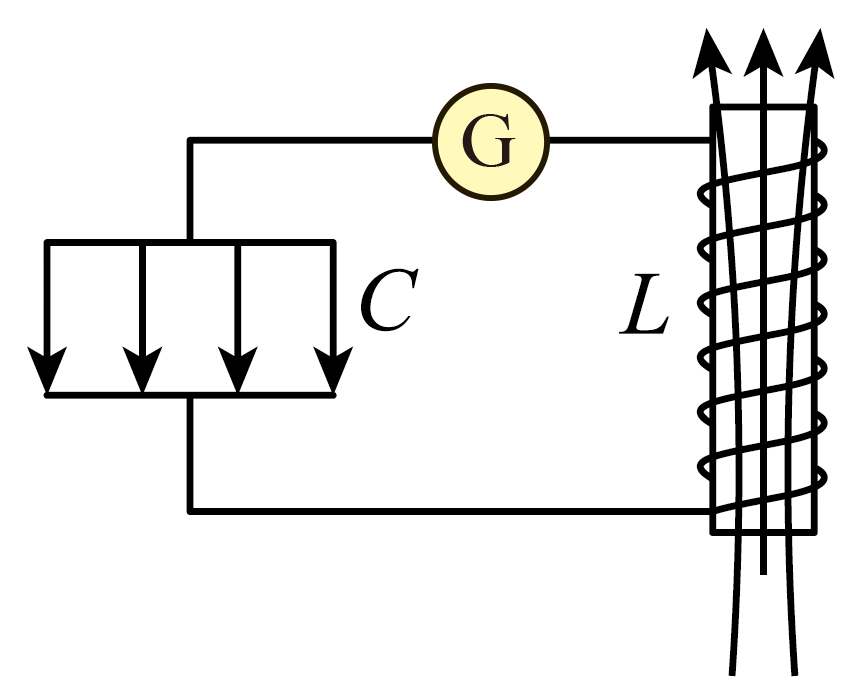

## 讲解

### 是什么

电容器C储存电场能，电感线圈L储存磁场能；先给电容器充电，再与线圈组成闭合回路，能量在两者之间反复转换，形成电磁振荡。$C$ 单位F，$L$ 单位H，极板带符号电荷 $q$ 单位C，电流 $i$ 单位A。

理想LC模型没有电阻热损耗和辐射损耗，电容、电感固定。充电指极板电荷绝对值增大，放电指绝对值减小；负电荷代数值减小不一定是放电。

### 怎么来的

初始极板电荷最多，电压最大，电流为零。接上线圈后，电容器电场驱动电流；自感阻碍电流突变，因此电流从零增大，电荷逐渐减少。

放电完毕时电荷为零，电流最大。线圈自感阻碍电流减小，保持原流向继续流动，把电容器反向充电。电流降为零时，电容器反向电荷最多；此后再次反向放电、充电，回到初态。

电场能和磁场能分别为

$$W_E=\frac{q^2}{2C}=\frac12Cu^2,\qquad W_B=\frac12Li^2.$$

理想回路 $W_E+W_B$ 恒定，所以一个达到最大时另一个为零。从正向最大电荷计时，每四分之一周期依次是：正电荷最大、电流最大、负电荷绝对值最大、反向电流最大。

### 什么时候能用

从图像判断时，电流绝对值增大意味着磁场能增大、正在放电；电流绝对值减小意味着正在充电。电流方向单独不足以决定充放电，须结合哪块板带什么电荷。

实际回路会衰减；持续等幅振荡需要外界补充损耗的能量。电阻较大时甚至没有往复振荡，不能把所有含L、C回路都按理想四分之一周期处理。

## 例题

> 题目与解析：第四章 电磁振荡与电磁波（专项训练）（解析版）.docx，来源ID S02，第12—21段。分段选取时保留该子问的完整题干、答案与解析；题目背景和原资料标注照录。

1．（24-25高二下·吉林长春·期末）在理想$LC$振荡电路中的某时刻，电容器极板间的电场强度$E$的方向、线圈电流产生的磁场方向如图所示，灵敏电流计电阻不计．下列说法正确的是（    ）

A．流过电流计的电流方向向右

B．电容器的电荷量正在减小

C．线圈中的磁感应强度正在减小

D．电容器两板间的电场强度正在减小

**原资料答案：** C

**原资料解析：** 

A．由线圈电流产生的磁场方向，结合右手螺旋定则可知，流过电流计的电流方向向左，故A错误；

BCD．电容器极板间的电场强度$E$的方向向下，说明上极板带正电，流过电流计的电流流向上极板，说明电容器正在充电，电容器的电荷量正在增大，电容器两板间的电场强度正在增大，而电流正在减小，线圈中的磁感应强度正在减小，故BD错误，C正确。

故选C。

### 顺着本题再看清一步

本图电场向下，故上板正、下板负；磁场向上，据绕线方向用右手螺旋定则，电流计电流向左，正电荷流向原已带正电的上板，处于充电。电荷绝对值、电场能增加，电流绝对值、磁场能减小。A方向错，B、D变化错，只有C成立。不能只凭“电流流向某板”判充电，还要看那块板的正负。

## 易错

“电荷减小”须明确指绝对值；“电流增大”在负半周须看绝对值。自感是阻碍变化，不是阻止电流流动，也不是始终阻碍电流本身。
