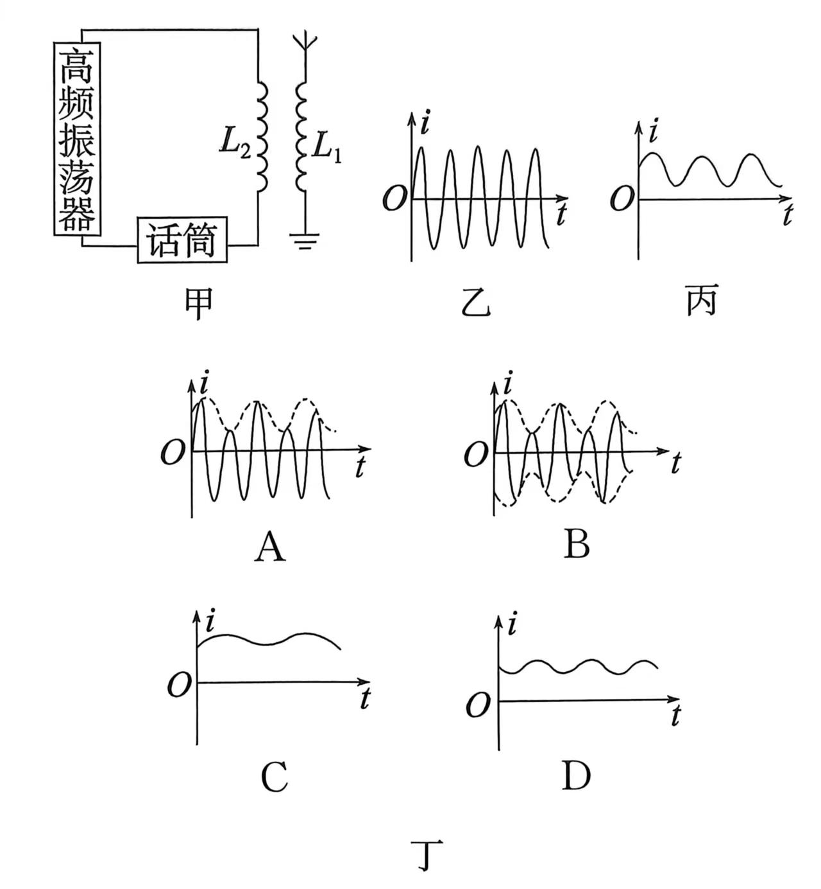

## 讲解

### 是什么

调制是让高频载波的某一参数随需要传送的信号改变。声音先由话筒变成低频电信号，高频振荡器产生载波，再由调制电路把信息加载到载波上，天线发射。

调幅AM让振幅随信号变；调频FM让瞬时频率随信号变。载波只是搬运信息的高频基础，未经信息控制的等幅单频振荡本身不能区分说话内容。

### 怎么来的

教材模型使用高频振荡和开放的天线结构以较有效地向空间辐射。低频信号改变载波参数，接收端才能据参数变化还原信息。调幅可表示为 $i(t)=A(t)\cos\omega_ct$，包络 $A(t)$ 随信号改变，正、负半轴的幅度都受同一包络约束。

调频主要看相邻波峰间距是否随信号改变；振幅可以保持近似不变。把调幅图只在正半轴画包络、负半轴幅值不变，会破坏该题的载波对称结构。

### 什么时候能用

本条讨论资料中的模拟调幅、调频。实际通信还有其他调制方式，不能把二者说成全部。教材“开放回路”指利于辐射的天线结构，不是简单断开导线就能无条件发射携带信息的电磁波。

调制发生在发送链路；调谐选定接收频段；解调还原信息。三者回答的问题不同。

## 例题

> 题目与解析：第四章 电磁振荡与电磁波（专项训练）（解析版）.docx，来源ID S02，第71—75段。分段选取时保留该子问的完整题干、答案与解析；题目背景和原资料标注照录。

6.实际发射无线电波的电路示意图如图甲所示；高频振荡器产生的高频等幅振荡信号如图乙所示：人对着话筒说话产生的低频振荡信号如图丙所示。发射出去的电磁波图像应是图丁中的	(    )

**原资料答案：** B

**原资料解析：** 要发射低频的声音信号，必须让高频振荡电流随着声音信号而变化，这就是调制，它不但影响了正半轴，也影响了负半轴，选项B正确

### 顺着本题再看清一步

图乙给高频等幅振荡，图丙给低频信号；看图丁是否保留密集高频振荡，且上下包络都随图丙变化。B同时满足，C、D缺高频载波，A的上下振幅变化与本题调制不符。

## 易错

正负半轴都属于同一载波，调幅的上下包络相应变化。C、D只剩低频变化，没有高频载波；A的包络不符合本题加载方式。
