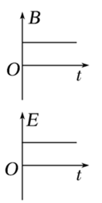
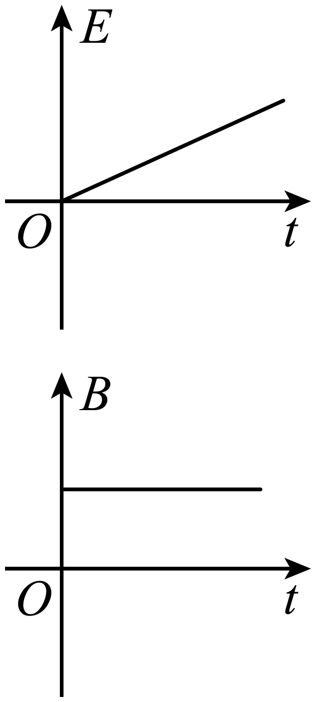
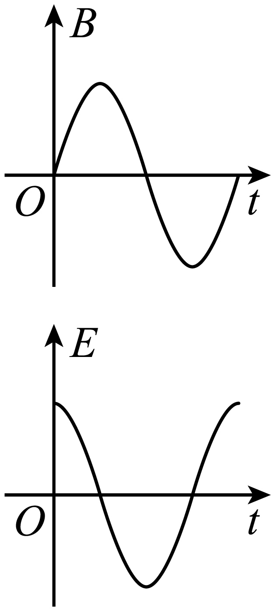
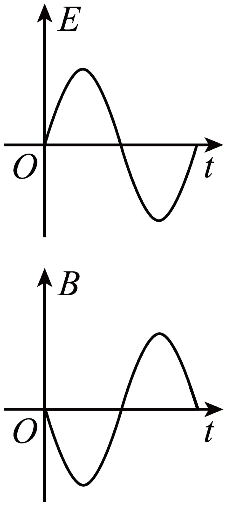

## 讲解

### 是什么

电场与磁场是相互联系的电磁场。变化的磁通量对应环流式感应电场；变化的电通量也参与产生磁场。电场强度E单位V/m，磁感应强度B单位T，时间变化率分别带每秒的单位。

### 怎么来的

法拉第感应实验表明，导体回路中的电流可由变化磁通量驱动；即使移去导体，感应电场仍存在。其环路积分满足 $\oint\mathbf E\cdot\mathrm d\mathbf l=-\mathrm d\Phi_B/\mathrm dt$，不是取决于磁场值本身。

麦克斯韦把变化电场也纳入磁场关系。充电电容器极板间没有电荷穿越绝缘层，但变化电场使两侧导线与极板间的磁场描述一致。由此统一电、磁现象并预言传播的电磁波；赫兹通过实验验证电磁波存在。[OpenStax麦克斯韦方程](https://openstax.org/books/university-physics-volume-2/pages/16-1-maxwells-equations-and-electromagnetic-waves)说明此联系。

### 什么时候能用

本章“均匀变化”指随时间线性变化，不是空间处处相同。固定几何和高中准静态模型中，变化率恒定对应恒定的感应场，周期变化对应周期感应场。源场恒定只是该变化项不贡献感应场，不能推出空间所有电场、磁场都为零，因为电荷、电流或别的源仍可贡献。

图中比较的是局部源场变化与感应场，不能拿这种变化率图直接描述远处平面电磁波的相位；自由传播平面波的E、B可同相。局部场变化也不自动证明有显著远场辐射，须看场源与传播条件。

## 例题

> 题目与解析：第四章 电磁振荡与电磁波（专项训练）（解析版）.docx，来源ID S02，第221—228段。分段选取时保留该子问的完整题干、答案与解析；题目背景和原资料标注照录。

11．（多选题）应用麦克斯韦电磁场理论判断下列表示电场产生磁场（或磁场产生电场）的关系图像中（每个选项中的上图是表示变化的场，下图是表示变化的场产生的另外的场）正确的是（　　）

A．

B．

C．

D．

**原资料答案：** BC

**原资料解析：** 

A．上图磁场不变，根据麦克斯韦电磁场，周围空间不会产生电场，故A错误；

B．上图是均匀变化的电场，应该产生恒定的磁场，下图的磁场是恒定的，故B正确；

CD．当磁场或电场周期性变化时，则会产生周期性变化的电场或磁场，当磁通量的变化率最大时，则感应电场最强，同理电场变化率最大时，产生的磁场最强。

故C正确，D错误。

故选BC。

### 顺着本题再看清一步

A上图斜率为零，不支持下图非零感应场；B电场时间斜率恒定，符合所给恒定磁场；C在B过零时感应E绝对值最大，符合变化率关系；D在E过零时所画B也为零，按该题模型不匹配。故BC。正负对应还依赖各图约定方向，不把近场的四分之一周期关系套到自由传播波。

## 易错

A中的恒定B不能由磁通量变化产生所画感应E；这不等于“恒定磁场附近绝不允许有电场”。C、D的区别是变化率关系，讨论对象是局部感应图。
