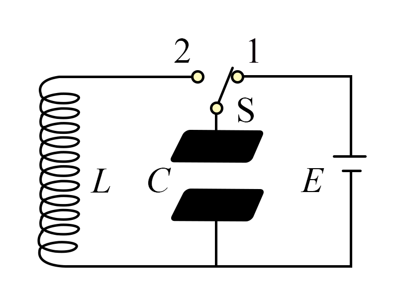

## 讲解

### 判据

给电荷图、电流图或某时刻电、磁场方向，要判断极板正负、充放电及能量转化。先确定初态与正方向，再把“大小”与“带符号量”分开。

### 流程

1. 若由电荷图判断，$|q|$ 减小为放电，$|q|$ 增大为充电。负区间q代数减小意味着负电荷绝对值增大，不能反着判。
2. 若由电流图判断，$|i|$ 增大则磁场能 $Li^2/2$ 增大，电场能减小，放电；$|i|$ 减小则充电。该判法来自理想总能量守恒。
3. 极板正负先由电场从正板指负板或初态确定。线圈磁场用右手螺旋定则得到电流方向，再查电流流向哪块板。流入正板通常增加其正电荷，流入负板则减少其负电荷。
4. 从初始满电、零电流出发，按T/4分区：放电、反向充电、反向放电、恢复原极性充电。中途电流最大处不会立即反向，要等反向充满、电流为零才反向。

理想LC题才可直接用这套分区，含电阻、二极管或外电源持续作用时重新列电路条件。

## 例题

> 题目与解析：第四章 电磁振荡与电磁波（专项训练）（解析版）.docx，来源ID S02，第22—31段。分段选取时保留该子问的完整题干、答案与解析；题目背景和原资料标注照录。

2.（2025·云南昆明·模拟预测）LC振荡电路通过调整电感和电容的值，可以控制振荡频率。这种电路常被用在调频收音机、无线通信设备中，用于产生本机振荡信号。一LC振荡电路如图所示，单刀双掷开关S先拨至触点1，使电容器与电源$E$接通。再将$S$拨至触点2并开始计时，若振荡周期为$T$，不计能量损失，下列说法正确的是（　　）

A．$t=\frac{T}{2}$时刻，两极板所带电荷量为零

B．$\frac{T}{4}∼\frac{T}{2}$时间内，线圈$L$中电流逐渐增大

C．$\frac{3T}{4}∼T$时间内，线圈$L$中磁场能逐渐减小

D．$t=\frac{6T}{7}$时刻，电容器上极板带负电

**原资料答案：** C

**原资料解析：** AB．由图可知电容器上极板和电源的正极相连，所以t=0时刻电容器上极板带正电荷且电荷量最大；$0∼\frac{T}{4}$时间内，电容器逆时针方向放电，电流逐渐增大，$t=\frac{T}{4}$时刻，电容器放电完毕，两极板所带电荷量为零，线圈中电流最大，磁场能最大。$\frac{T}{4}∼\frac{T}{2}$时间内，电容器逆时针方向充电，下极板带正电，电流逐渐减小，$t=\frac{T}{2}$时刻，电流为零，线圈中磁场能最小，电容器两极板所带电荷量达到最大，故AB错误；

CD．$\frac{3T}{4}∼T$时间内，电容器顺时针方向充电，电容器上极板带正电，即$t=\frac{6T}{7}$时刻，电容器上极板带正电，电流逐渐减小，线圈$L$中磁场能逐渐减小，故C正确，D错误。

故选C。

### 顺着本题再看清一步

初态上板正且满电。A的T/2处应电荷绝对值最大，错误；B第二区间在充电、电流减小，错误；C第四区间磁场能转回电场能，正确；D第四区间上板为正，错误。故C。

## 易错

T/2时反向充满，而非无电荷；T/4至T/2电流绝对值减小。6T/7落第四区间，上板已回到正电荷，D不成立。
