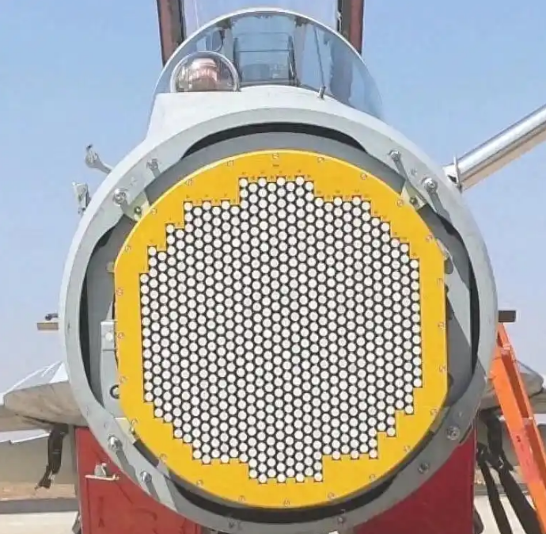

## 讲解

### 判据

通过验钞、遥感、雷达、透视等识别波段，或比较波长、频率和能量。按题干明确的工作特征推断，不能只凭“穿透”“治疗”把某波段判成唯一答案。

### 流程

1. 先将波段沿常用谱序定位，真空 $f=c/\lambda$，单光子能量 $hf$。频率大小与波长大小相反。
2. 再抓工作特征：红外辐射关联温度探测；紫外使特定物质荧光，验钞查的是荧光；雷达常用方向性较好的微波，借反射测距。
3. 比较应用时说明是典型而非排他。X和γ都可穿透和电离，也都可能用于医学；剂量、能量与装置决定具体用途，不能把“X只检查、γ只治疗”当成普遍定律。
4. 场变化与传播波的产生分开看。周期源是典型发波方式，局部随时间变化不充分证明所问的传播波；非周期脉冲同样可传播。

本条不自行扩充新题或医学使用方案，只用资料的物理特征完成判别。

## 例题

> 题目与解析：第四章 电磁振荡与电磁波（专项训练）（解析版）.docx，来源ID S02，第45—56段。分段选取时保留该子问的完整题干、答案与解析；题目背景和原资料标注照录。

4．（河南省洛阳市2025-2026学年高二上学期11月期中物理试题）我国外销明星战机歼-10CE，使用了有源相控阵雷达，我国有源相控阵雷达探测距离远，抗干扰能力强，能够实现先敌发现，先敌攻击。有源相控阵雷达的辐射器如图所示，每个辐射器都配装有一个发射、接收组件，每个组件都能自己产生、接收电磁波中的微波。关于电磁波，下列说法正确的是（　　）

A．电磁波波长越长，其能量子越大

B．红外线的频率比紫外线的频率小

C．红外线的波长比可见光的波长短

D．只要空间某处的电场或磁场发生变化，就会在其周围产生电磁波

**原资料答案：** B

**原资料解析：** 

A．根据公式$E=hν$以及$c=λν$，可得$E=\frac{hc}{λ}$，由此可知，电磁波波长越长，其能量子越小，故A错误；

B．在电磁波谱中，红外线的频率范围低于紫外线的频率范围，所以红外线的频率比紫外线的频率小，故B正确；

C．可见光中紫光波长最短，红光波长最长，而红外线的波长比红光更长，所以红外线的波长比可见光的波长长，故C错误；

D．根据麦克斯韦的电磁场理论，只有周期性变化的电场和磁场才能在其周围产生电磁波，均匀变化的电场和磁场只能产生恒定的磁场和电场，不能产生电磁波，故D错误。

故选B。

### 顺着本题再看清一步

A由ε=hc/λ可见长波长能量子更小，错误；B红外频率低于紫外，正确；C红外波长长于可见，错误。D“只要某处变化”忽略传播源与空间条件，不成立；但原解析把周期变化写成唯一发波途径也不严谨，非周期电磁脉冲可传播。

## 易错

A讨论的是单个能量子，不能等同整束总能量。C把红外排到可见光短波一边。D的原解析“只有周期变化”需要修正为教材典型条件而非必要条件。
