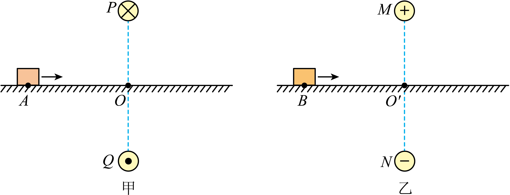

## 错法

把定义式B＝F/(IL)当无条件恒等式，看到F＝0便写B＝0。错误发生在忽略导线与B夹角；还可能把静止、匀速或总合力零误读成磁场力零。

## 正解

先排除I＝0和导线方向平行B等因素。一般直导线F＝BIL sinθ，θ＝0或180°时有sinθ＝0，零力只说明这个试探方向没显示磁场，不说明B消失。

真正用零力推断B，要有非零I、有效L以及已知垂直方向等条件；多力平衡时还必须单独辨磁力。下面原题采用带电物块的qvB sinθ，同样展示“平行方向使力为0而场不为0”，对象不是测B导线，公式不混用。

## 例题

> 题目与解析：第十三章 电磁感应与电磁波初步（专项训练）（解析版）.docx，来源ID S02，第76—85段。分段选取时保留该子问的完整题干、答案与解析；题目背景和原资料标注照录。

7．（2025·四川达州·模拟预测）如图甲所示，两足够长的通电直导线$P$、$Q$关于光滑水平面对称分布，$O$点是$P$、$Q$连线与水平面的交点，$P$、$Q$中的恒定电流大小相等、方向相反。一带正电的绝缘物块1（可视为质点）从A点以一定的初速度向右运动，某时刻经过$O$点。类似情景如图乙所示，$M$、$N$是带等量异种电荷的带电体（可视为点电荷），二者关于光滑水平面对称分布，$O'$点是$M$、$N$连线与水平面的交点。一带正电的绝缘物块2（可视为质点）从$B$点以与物块1相同的初速度向右运动，某时刻经过$O'$点，已知$AO=BO'$，关于这两个情景，下列说法正确的是（   ）

A．$O$点磁感应强度为0，$O'$点电场强度也为0

B．物块1从A到$O$做匀速直线运动，物块2从$B$到$O'$做匀减速直线运动

C．物块1到达$O$点的速度与物块2到达$O'$的速度相同

D．物块1从A到$O$的时间大于物块2从$B$到$O'$的时间

**原资料答案：** C

**原资料详解：** 

A．$O$点的磁感应强度向左，不为0，故A错误；

BCD．由于$AO$线上磁感应强度水平向左，物块1不受洛伦兹力，做匀速直线运动；$BO'$线上电场强度竖直向下，物块2水平方向上不受力，也做匀速直线运动，故BD错误，C正确。

故选C。

### 顺着本题再看清一步

这是一道带电物块原题，不是用通电导线测B的实验；它检验同样的边界：“没受磁力”不能直接说“没磁场”。甲中上下两根反向电流的磁场在AO线上均向左，合场不为0，A错；物块向右，与B反平行，洛伦兹力为0，匀速通过。

乙中对称异号电荷在水平面上的合电场竖直向下，不为0；竖直受力由支持力平衡，水平方向无合力，也匀速通过。因此B把物块2判成减速错误；C速度相同正确；D路程AO＝BO′且速度相同，时间相同，错误。不能把物块的qvB公式与导线ILB公式的试探对象混在一起。
