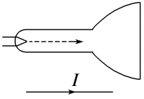

## 讲解

### 是什么

本章所说的洛伦兹力是磁场对运动电荷的力，大小为

$$F_B=|q|vB\sin\theta$$

$q$是带符号电荷量，单位C；计算大小取$|q|$；$v$是粒子速率，单位m/s；$B$的单位为T；$\theta$是速度与磁场夹角。电荷静止或速度平行磁场时，这个力为零。正电荷按左手定则，四指指速度；负电荷四指指速度的反方向。

力非零时垂直于瞬时速度，也垂直于磁场。若还存在电场，电荷还受到$q\mathbf E$；电场力与磁场力应分别求出再合成。

### 怎么来的

实验发现，运动电荷受到的磁场力与电荷量、垂直磁场的速度分量、磁感应强度成正比。把速度分解为平行分量和垂直分量，平行分量不产生磁场力，垂直分量为$v_\perp=v\sin\theta$，故$F_B=|q|Bv_\perp$。

这一力与速度垂直，瞬时功率是力在速度方向的分量乘速率，因此

$$P_B=\mathbf F_B\cdot\mathbf v=0$$

在只受磁场力的条件下，动能不变，速率不变；速度作为矢量仍可不断改变方向。安培力是许多载流子作用传递给导线后的宏观表现，不能因此推断安培力对整根移动导线也一定不做功。

### 什么时候能用

判断力必须使用粒子所在位置的磁场和当时的速度；粒子转弯后，不能继续使用最初的受力方向。仅凭“磁场力不做功”只能排除磁场力直接改变动能，不能排除电场、重力、阻力等其他力的功。

若只有静态匀强磁场且重力可忽略，垂直入射为匀速圆周运动；斜入射则沿磁场方向匀速、垂直方向绕圈，合成螺旋运动。不要把所有“带电粒子在磁场内”都判为平面圆周运动。

## 例题

> 题目与解析：第一章 安培力和洛伦兹力（专项训练）（解析版）.docx，来源ID S04，第55—63段。分段选取时保留该子问的完整题干、答案与解析；题目背景和原资料标注照录。

5．如图所示，在示波器下方有一根与示波器轴线平行放置的通电直导线，直导线中的电流方向向右，在该电流的影响下，关于示波器中的电子束的下列说法正确的是（示波器内两个偏转电场的偏转电压都为零，不考虑地磁场的影响）（　　）

A．电子束将向下偏转，电子的速率保持不变

B．电子束将向外偏转，电子的速率逐渐增大

C．电子束将向上偏转，电子的速率保持不变

D．电子束将向里偏转，电子的速率逐渐减小

**原资料答案：** C

**原资料详解：** 由安培定则可知，电流在电子运动的位置产生的磁场向外，根据左手定则可知，电子束将向上偏转；由于洛伦兹力对电子不做功，故电子的速率保持不变。

故选C。

### 顺着本题再看清一步

四个选项把“方向”和“速率”绑在一起。A的速率判断正确但偏转方向错误；B、D同时把方向和速率说错；C的两个判断都符合磁场方向及不做功条件。

## 易错

- 左手定则前，先用右手螺旋定则确定直导线在电子束位置产生的磁场。本题电子束处磁场向外，然后再对负电荷判断受力向上。
- 向上偏转不表示速率增大；本题偏转电压为零、只考虑磁场作用，速率保持不变。
- 洛伦兹力不做功不等于没有加速度：方向改变就有加速度。
