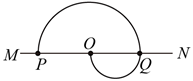

## 讲解

### 是什么

带电粒子以速度垂直进入匀强磁场，且只受磁场力时，在垂直磁场的平面内做匀速圆周运动。“匀速”指速率恒定，速度方向沿轨迹切线不断改变；磁场力沿半径指向圆心。

设质量$m$，电荷量大小$|q|$，磁感应强度$B$，速率$v$，轨道半径$r$，周期$T$，则

$$r=\frac{mv}{|q|B},\qquad T=\frac{2\pi m}{|q|B}$$

对应单位分别为kg、C、T、m/s、m、s。正负电荷的转弯方向相反；半径和周期都为正数。

### 怎么来的

先从磁场力提供向心力出发：$|q|vB=mv^2/r$。两边除以$v$，得$|q|B=mv/r$；再乘$r$、除以$|q|B$，得$r=mv/(|q|B)$。

一周路程为$2\pi r$，周期是路程除以速率：$T=2\pi r/v$。把刚求出的半径代进去，分子中的$v$与分母中的$v$约去，得到$T=2\pi m/(|q|B)$。所以同一粒子在同一磁场中，速率增大使轨道变大，但周期不变。

转过圆心角$\varphi$弧度时，弧长为$r\varphi$，用弧长除以速率得到

$$t=\frac{r\varphi}{v}=\frac{\varphi}{2\pi}T$$

角度若用度，比例应写成$\varphi/360^\circ$，不能把度数直接除以$2\pi$。

### 什么时候能用

要求匀强磁场、垂直入射、忽略重力及其他作用，并处于高中使用的非相对论速度范围。在有边界的磁场内常只走一段圆弧，运动时间要取实际圆心角。

穿越铝板会因碰撞损失动能，跨过铝板前后的速率可不同；在各自纯磁场区域内仍分别保持速率。若两区磁场不同，周期也可能不同，不能只看“粒子是同一个”就说时间相同。

## 例题

> 题目与解析：第一章 安培力和洛伦兹力（单元测试·基础卷）（解析版）.docx，来源ID S06，第14—23段。分段选取时保留该子问的完整题干、答案与解析；题目背景和原资料标注照录。

2．如图所示，MN为铝质薄平板，铝板上方和下方分别有垂直于纸面的匀强磁场(未画出)。一带电粒子从紧贴铝板上表面的P点垂直于铝板向上射出，从Q点穿越铝板后到达PQ的中点O。已知粒子穿越铝板时，其动能损失一半，速度方向和电荷量不变，不计重力。铝板上方和下方的磁感应强度大小之比为(    )

A．1∶2

B．2∶1

C．$\sqrt2$∶2

D．$\sqrt2$∶1

**原资料答案：** C

**原资料详解：** 设带电粒子在P点时初速度为v1，从Q点穿过铝板后速度为v2，则

$E_{k1}=\frac12mv_1^2$，$E_{k2}=\frac12mv_2^2$由题意可知$E_{k1}=2E_{k2}$即$\frac12mv_1^2=mv_2^2$则$\frac{v_1}{v_2}=\sqrt2$由洛伦兹力提供向心力，即

$qvB=m\frac{v^2}{r}$得$B=\frac{mv}{qr}$由题意可知$\frac{r_1}{r_2}=2$所以$\frac{B_1}{B_2}=\frac{v_1r_2}{v_2r_1}=\frac{\sqrt2}{2}$

故C正确。

故选C。

### 顺着本题再看清一步

解析中的速度下降发生在铝板内，能量由粒子与铝板的相互作用转移；没有发生“洛伦兹力做负功”。本题A、B只使用几何比例，D只使用速度比例，都漏掉另一因素。

## 易错

- 动能减半不是速率减半：由$E_k=mv^2/2$知$v_2=v_1/\sqrt2$。
- 本题上、下半圆直径分别是$PQ$和$QO$，因O是PQ中点，$r_1/r_2=2$；不能拿图形高度的视觉比例代替题干关系。
- 半径同时受$v$和$B$影响：$B_1/B_2=(v_1/v_2)(r_2/r_1)=\sqrt2/2$，对应C。
