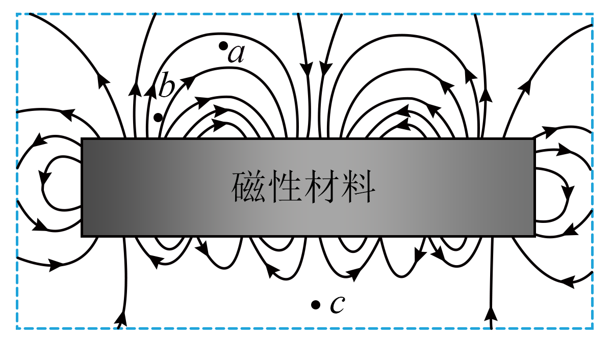

## 讲解

### 是什么

磁感线是描述磁场的假想曲线，曲线上某点的切线方向表示该处磁场方向。同一绘图约定下，越密表示场越强；磁感线本身不是实际存在的细线。

小磁针足够小、能自由转动且对原场影响可忽略时，静止N极指向给当地磁场方向。条形磁体外部磁感线由N到S，内部由S到N，形成连续回路。磁场可以存在于磁体内部。

### 怎么来的

在磁体附近不同位置放小磁针，把各处N极方向记录并连成与这些方向相切的曲线，就得到磁场的方向图。曲线位置只是作图选择，客观的是各处B及其方向。

同一点若画两条磁感线相交，就会给出两个不同切线方向；而同一点的非零合磁场只有一个方向，故不能相交。两磁场重叠时先作B的矢量相加，再画合场线，不能把两套线交叉当合磁感线。

电场线可从正电荷出发到负电荷结束；磁感线没有这样的磁单极起止。在常见有限磁体、电流模型中呈闭合回路；无限理想模型中画到图外的线也不能理解为在图边缘中断。

### 什么时候能用

只比较同一示意图内、同一约定下的疏密，不把不同图画的线数直接比成绝对B值。若合B为0，该点磁场方向未定义，不靠两条相交线赋予方向。

磁感线曲线方向是局部切线，不能用磁体中心到该点的连线代替。磁针N极指向也不能当通电导线所受力方向；场方向与力方向是不同量。

## 例题

> 题目与解析：第十三章 电磁感应与电磁波初步（单元测试·基础卷）（解析版）.docx，来源ID S06，第6—11段。分段选取时保留该子问的完整题干、答案与解析；题目背景和原资料标注照录。

1．某块磁性材料附近的磁感线分布如图所示，$a$、$b$、$c$为磁场中的三点，则$a$、$b$、$c$三点的磁感应强度大小关系为（　　）

A．$B_c>B_b>B_a$

B．$B_b>B_c>B_a$

C．$B_c>B_a>B_b$

D．$B_b>B_a>B_c$

**原资料答案：** D

**原资料详解：** 根据磁感线越密集的地方磁感应强度越大，由图可知$B_b>B_a>B_c$。

故选D。

### 顺着本题再看清一步

先比较同一图中磁感线疏密，b最密、a其次、c最疏，所以B_b＞B_a＞B_c，D正确。A与C都把c判成最强，和最疏的图示冲突；B虽然判b最强，但将c放到a前，仍错。磁感线条数由绘图选择，不能把“这里画了三条”当成磁场的绝对数值。

## 易错

磁感线是假想线，磁场客观存在；外部N到S不是全部磁感线的起止；沿弯曲线要取该点切线。
