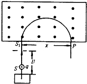

## 讲解

### 是什么

质谱仪使离子通过电场和磁场，在不同位置留下信号，由运动规律测出质量与电荷量的比值。高中常见模型包括离子源、加速电场、偏转磁场和记录落点的底片；有的还设速度选择器。磁场单独测得的是比荷$|q|/m$或质荷比$m/|q|$，不是无条件测出质量。

### 怎么来的

初速可忽略的正离子经过电压大小$U$加速，电场做功$qU$，由动能定理有$qU=mv^2/2$，所以$v=\sqrt{2qU/m}$。垂直进入磁场后，$r=mv/(qB)$。把速度代入并平方：

$$r^2=\frac{m^2}{q^2B^2}\frac{2qU}{m}=\frac{2mU}{qB^2}$$

若粒子偏转半周回到入口所在直线，落点到入口的距离$x$是直径，$x=2r$。两边平方并代入上一式得$x^2=8mU/(qB^2)$，再移项得到

$$\frac{q}{m}=\frac{8U}{B^2x^2}$$

$U$单位V，$B$单位T，$x$单位m，比荷单位C/kg。相同加速电压下，比荷越小，半圆直径越大。

### 什么时候能用

这一结果要求初速可忽略、相同加速电压、垂直进入同一匀强磁场，并且落点距离确实对应半圆直径。若初速不能忽略，应保留初动能；若通过速度选择器，则先由电场力和磁场力平衡求$v=E/B'$，再使用偏转区磁场$B$。

比较同位素质量，还需离子带相同电荷量，也就是相同电荷态。不同电荷态可能有相同比荷，落在相同位置；不能仅用同位素名称推断每个离子都只带一个单位正电荷。

## 例题

> 题目与解析：第一章 安培力和洛伦兹力（单元测试·基础卷）（解析版）.docx，来源ID S06，第83—99段。分段选取时保留该子问的完整题干、答案与解析；题目背景和原资料标注照录。

8．质谱仪是一种测定带电粒子质量和分析同位素的重要工具，它的构造下原理如图，离子源S产生的各种不同正离子束（速度可看作0），经加速电场加速后垂直进入有界匀强磁场，到达记录它的照相底片P上，设离子在P上的位置到进入磁场处的距离为x，可以判断(    )

A．若离子束是同位素，则x越大，离子的质量越大

B．若离子束是同位素，则x越大，离子的质量越小

C．只要x相同，则离子的比荷一定相等

D．只要x相同，则离子的质量一定相等

**原资料答案：** AC

**原资料详解：** 设离子质量为m，若离子束是同位素，则所带电荷量相同，均设为q。设离子经加速电场加速后获得的速度大小为v，根据动能定理有

$qU=\frac12mv^2$①

设匀强磁场的磁感应强度大小为B，离子做匀速圆周运动的半径为r，根据牛顿第二定律有

$qvB=m\frac{v^2}{r}$   ②

由题意可知

$x=2r$   ③

联立①②③解得

$x=\frac2B\sqrt{\frac{2mU}{q}}$   ④

由④式可知x越大，m越大，且只要x相同，离子的比荷一定相同，故AD正确，BC错误。

故选AC。

### 顺着本题再看清一步

逐项核对：A、B讨论质量大小，只有在$q$相同的本题模型下才能由$x^2\propto m$判断；C由上面的比荷表达式直接成立；D还缺“电荷量相同”条件，因此不成立。

## 易错

- 本题按原解析设同位素离子电荷量相同，A正确、B错误；同落点只能确定比荷，C正确、D错误。
- **原资料第98段“AD正确，BC错误”与题目选项不对应，是标号笔误；应为“AC正确，BD错误”。** 原答案AC与公式判断一致。
- 从底片量到的$x$是直径，直接把$x$当半径会使比荷差4倍。
