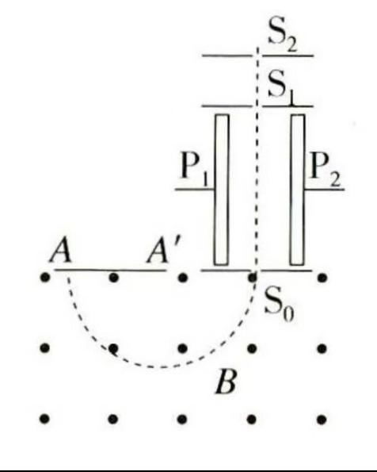

## 讲解

### 判据

题图按空间分为离子源、加速区、速度选择区、偏转区、底片，就按区分别建立模型。电场能改变动能；交叉场可筛选速度；纯磁场改变方向并给出半径。各区域字母可能相近，先把$B'$的选择场和$B$的偏转场分开。

### 流程

1. 初速可忽略的离子在加速区用动能定理：$qU=mv^2/2$。若初速不为零，右边是末动能减初动能，不能把原式直接套上去。
2. 有速度选择器且粒子沿直线通过时，先检查电场力与磁场力是否相反，再令$qE=qvB'$，约去$q$得到$v=E/B'$。这一步决定实际进入偏转区的速度。
3. 偏转区没有电场时，列$qvB=mv^2/r$，化为$r=mv/(qB)$。必须使用刚离开上一段的速度，不能同时把$v=E/B'$与另一种任意质量的零初速加速速度当成独立可调条件。
4. 半周回到入口边界，量到的落点距离$L=2r$。无选择器或题目第(1)问忽略初速时，由加速和偏转两式求$q/m=8U/(B^2L^2)$。
5. 两种相同电荷态离子经选择器以相同速度进入偏转区，落点间距满足$\Delta L=2v\Delta m/(qB)$。代$v=E/B'$后，得

$$\Delta m=\frac{qBB'}{2E}\Delta L$$

这表达式取正的质量差和对应落点距离差大小；若用有向差，应同时约定哪个离子减哪个离子。

求质量之前核对电荷量是否已知且相同；轨迹不能区分相同比荷的不同离子。

## 例题

> 题目与解析：第一章 安培力与洛伦兹力（复习讲义）（解析版）.docx，来源ID S02，第237—246段。分段选取时保留该子问的完整题干、答案与解析；题目背景和原资料标注照录。

【变式5-2】质谱仪是一种研究同位素的工具，如图所示为倍恩勃立奇等设计的质谱仪结构示意图.从离子源产生的同位素离子，经过${S}_{2}、{S}_{1}$之间的电压U加速，穿过平行板${P}_{1}、{P}_{2}$区间，从缝$S_{0}$垂直射入磁感应强度为B的匀强磁场，偏转半周后打在照相底片上，不计离子重力.

（1）若忽略某离子进入缝S2时的速度，在底片上的落点到缝S0的距离为L，求该离子的比荷$\frac{q}{m}$

（2）实际上，离子进入$S_{2}$时有不同的速度，为降低其影响，在${P}_{1}、{P}_{2}$间加均垂直于连线${S}_{1}{S}_{0}、$场强为E的匀强电场和磁感应强度为B＇的匀强磁场，电场方向由${P}_{1}$指向${P}_{2}$，试指出磁场B＇的方向.若带电荷量为q的两个同位素离子在底片上的落点相距ΔL，求它们的质量差Δm.

**原资料答案：** （1）$\frac{q}{m}$=$\frac{8U}{{B}^{2}{L}^{2}}$  （2）$∆m=$ $\frac{qB{B}^{,}}{2E}∆L$

**原资料解析：** （1）对离子在$S_{2}$,$S_{1}$之间的加速过程中，有qU =$\frac{1}{2}m{v}^{2}$;

对离子在磁场B中的偏转过程qvB=$m\frac{{v}^{2}}{r}$,且2r=L,联立得$\frac{q}{m}$=$\frac{8U}{{B}^{2}{L}^{2}}$

（2）)磁场B'的方向应垂直于纸面向外。

要使离子沿连线$S_{1}$S。运动，则有qvB'=qE,

对两个同位素离子(设$m_{1}$>$m_{2}$)，在磁场B中,$∆m=$ $\frac{qB{B}^{,}}{2E}∆L$

### 顺着本题再看清一步

由$r=mv/(qB)$对两离子分别列式，先相减：$r_1-r_2=v(m_1-m_2)/(qB)$。底片距离差是半径差的两倍，再把速度选择器给出的速度代入，就得到完整的质量差关系。这比直接背最终公式更能避免混淆两个磁场。

## 易错

- 磁场方向不能只凭“电场向右”硬记。本题正离子向下运动，电场力向右，要平衡需磁场力向左，所以选择场$B'$向纸外。
- 第(1)问按零初速加速模型求比荷；第(2)问引入选择器控制速度，质量差使用同一入场速度，两个设问条件要分开。
- 原答案中的$B^{,}$按题干表示$B'$；它不是求导，也不是另一个数值。
