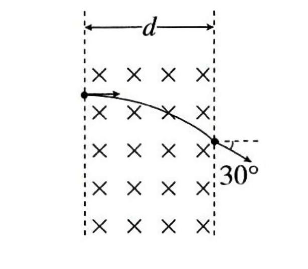
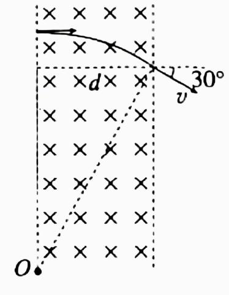

## 讲解

### 判据

粒子在匀强磁场内垂直磁场运动、只受磁场力，轨迹为圆弧。入口或出口速度沿圆的切线，所以圆心在这些速度的垂线上。题目给边界、出射方向或偏转角时，先做几何定位，再用半径和周期公式。

### 流程

1. 用电荷正负、速度和磁场判断刚入场受力侧。圆心只能位于这一侧，先排除另一条形式上也满足垂直关系的候选半径。
2. 已知入出点及速度方向，分别过两点作速度垂线，交点为圆心。只有一端速度和另一端位置时，过已知端作速度垂线，再作两点弦的中垂线，交点为圆心。
3. 画出粒子实际走的那段圆弧，标半径、边界宽度和角度。与边界相切表示特定临界条件；不能把“垂直射出边界”误画成轨迹与边界相切。
4. 由直角三角形等几何关系求$r$。再把$|q|vB=mv^2/r$用于动力学，算未知质量、磁场或速度。
5. 取实际经过的圆心角$\varphi$，用$t=(\varphi/2\pi)T$，其中$T=2\pi m/(|q|B)$。出口速度偏转角可能对应短弧或长弧，要看电荷的转向及是否先碰另一边界，不能只取两条直线的锐角。

最后用弧长$r\varphi$除以速率复核时间。题目有电场、场外直线段时，把这些时间分别算后相加，不把磁场时间当全程时间。

## 例题

> 题目与解析：第一章 安培力与洛伦兹力（复习讲义）（解析版）.docx，来源ID S02，第169—180段。分段选取时保留该子问的完整题干、答案与解析；题目背景和原资料标注照录。

【变式3-2】如图所示，一个电子（电荷量为e）以速度${v}_{0}$垂直射入磁感应强度为B，宽为d的匀强磁场中，穿出磁场的速度方向与电子原来的入射方向的夹角为30°（电子重力忽略不计），求：

（1）电子的质量是多少？

（2）穿过磁场的时间是多少？

**原资料答案：** （1）$m=\frac{2Bed}{{v}_{0}}$   （2） $t=\frac{\pi d}{3{v}_{0}}$

**原资料解析：** (1)电子在磁场中运动，只受洛伦兹力作用，故其轨迹是圆弧的一部分，设圆心为0点，如图所示。

根据几何关系可得$R=\frac{d}{sin{30}^{0}}$解得R=2d

根据洛伦兹力提供向心力，则有$Be{v}_{0}=m\frac{{v}_{0}^{2}}{R}$

解得$m=\frac{2Bed}{{v}_{0}}$。

(2)电子穿过磁场的时间是$t=\frac{1}{12}T$

解得$t=\frac{\pi d}{3{v}_{0}}$

### 顺着本题再看清一步

看到“穿出时偏转30°”，想到两条半径分别垂直入出速度，夹角同为30°；磁场宽是水平距离，因此从圆心到出射点的半径投影给出$d=r\sin30^\circ$。若直接用$d/v_0$，把弧线误当横向匀速直线，会漏掉曲线长度。

## 易错

- 本题轨迹仅偏转30°，圆心角30°；磁场宽$d$等于$r\sin30^\circ$，不是半径或弧长。
- 因$r=2d$，从$ev_0B=mv_0^2/(2d)$得$m=2Bed/v_0$；时间是$T/12$，得$\pi d/(3v_0)$。
- 原公式中的$\sin30^0$按上下文是30°的角度标注，正文讲解已规范为$\sin30^\circ$，不是把30的零次幂取正弦。
