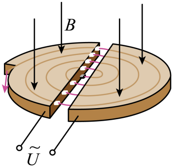

## 讲解

### 判据

题目出现两个D形盒、固定匀强磁场和交变电压，要判断粒子能否每次过缝都被加速，就检查相邻两次过缝的时刻、速度方向和电场方向。对非相对论粒子，基本同步条件为电压周期等于回旋周期，狭缝时间忽略。

### 流程

1. 在盒内只用磁场偏转模型。由$r=mv/(|q|B)$和$T=2\pi r/v$求$T=2\pi m/(|q|B)$；增大速率只增大半径，不改变该周期。
2. 粒子走半圆后过缝，此时速度方向反向。因此电场也要反向，才能保证电场力沿速度、做正功。基本模型令交流电压半周期等于$T/2$，所以$f=|q|B/(2\pi m)$。
3. 固定粒子和磁场时，检查电压初相位与注入时刻是否对应加速方向；只写频率相等还不能保证任意时刻注入都加速。
4. 每次能量增加$|q|U$，累计动能为$E_{k0}+n|q|U$。半径逐次变大，而盒内每半圈的时间仍相同，所以能够使用固定频率重复加速。
5. 再检查近似范围：狭缝通行耗时不能显著，粒子速度不能使相对论修正破坏同步；题目若改变粒子种类，要重新算比荷对应的周期，不能沿用原频率。

本章使用“一个周期两次加速”的基本同步模式。专门的高次谐波工作模式属于拓展，不能自行用它替代题设。[同步与高速边界核对](https://openstax.org/books/university-physics-volume-2/pages/11-7-applications-of-magnetic-forces-and-fields)。

## 例题

> 题目与解析：第一章 安培力和洛伦兹力（专项训练）（解析版）.docx，来源ID S04，第155—173段。分段选取时保留该子问的完整题干、答案与解析；题目背景和原资料标注照录。

12．如图所示，回旋加速器D形盒的半径为R，所加磁场的磁感应强度大小为B、方向垂直D形盒向下。质子从D形盒中央由静止出发，经电压为U的交变电场加速后进入磁场，若质子的质量为m，带电荷量为e，质子在电场中运动的时间忽略不计，则下列分析正确的是（    ）

A．质子在回旋加速器中加速后获得的最大动能为$\frac{{e}^{2}{B}^{2}{R}^{2}}{2\,\mathrm{m}}$

B．质子在回旋加速器中加速的次数为$\frac{\pi m}{eB}$

C．质子在回旋加速器中加速的次数为$\frac{2e{B}^{2}{R}^{2}}{mU}$

D．质子在回旋加速器中运动的时间为$\frac{\pi B{R}^{2}}{2U}$

**原资料答案：** AD

**原资料详解：** 

A．质子在磁场中做匀速圆周运动，质子轨道半径等于D型盒半径R时速度最大，对质子，由牛顿第二定律得$evB=m\frac{{v}^{2}}{R}$

质子的最大动能${E}_{km}=\frac{1}{2}m{v}^{2}$

解得${E}_{km}=\frac{{e}^{2}{B}^{2}{R}^{2}}{2\,\mathrm{m}}$

故A正确；

BC．对质子，由动能定理得$neU=\frac{1}{2}m{v}^{2}-0$

解得$n=\frac{e{B}^{2}{R}^{2}}{2mU}$

故BC错误；

D．质子在磁场中做匀速圆周运动的周期$T=\frac{2\pi r}{v}=\frac{2\pi m}{eB}$

质子在回旋加速器中的运动时间$t=\frac{n}{2}T$

解得$t=\frac{\pi B{R}^{2}}{2U}$

故D正确。

故选AD。

## 易错

- 交变电场负责能量增长，恒定磁场负责弯曲轨迹；“磁场也在加速”只能表示改变速度方向，不能表示增加动能。
- A所给最大动能与$U$无关，是尺寸限制；提高$U$使次数变少，不自动提高相同盒半径的最大速度。
- 原D计时是忽略首末端差别的近似式。首圈从静止进入第一段的具体时刻、最后一次过缝后何时引出，应根据题设计半圈，不能机械认为精确$n$次加速必有$n$个半圈。
