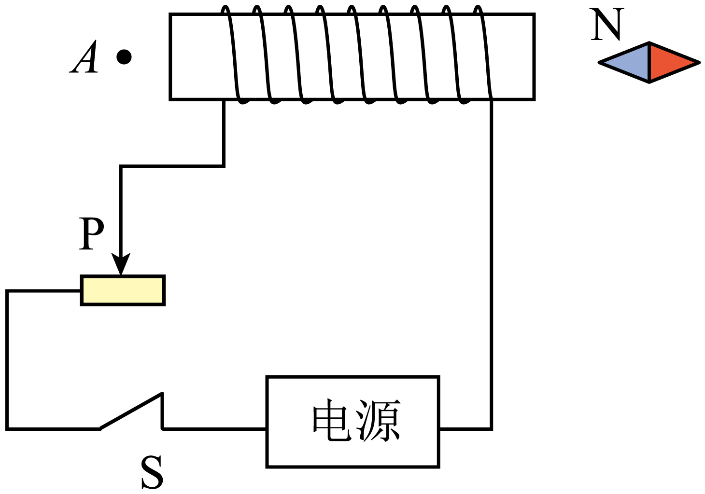

## 讲解

### 判据

给电流方向要求直导线、圆环或螺线管磁场方向，用右手的安培定则。直导线拇指沿电流，四指绕场；圆环或螺线管四指沿绕行电流，拇指沿内部轴向磁场。

圆点表示向纸面外，叉表示向纸面里；电流用约定正电荷方向，若给电子运动先反向。这里判“场”，不是用左手定则判导线受力。

### 流程

1. **顺电路确定电流。** 原题先由右侧磁针N极向左，知螺线管右端是S、左端是N。内部轴向B向左，右手拇指向左，四指沿绕线方向反推电流从右端进入。

2. **落实电源极性。** 外电路电流从电源正端流出，沿图示线路追踪得电源右端为正，故A说负极错误；不能只看电池画在纸面哪边。

3. **分方向和强弱。** 向右移滑片增大实际接入电阻，源电流减小，螺线管磁性减弱，B错误。换电源极性使绕行电流反向，N/S互换，磁针反转，C错误。

4. **从内部场转到外部场。** 螺线管外部磁感线由N返回S，左端A处沿线向左，与右侧磁针N极向左相同，D正确。不要把内部与全部外部都当同一轴向。

## 例题

> 题目与解析：第十三章 电磁感应与电磁波初步（单元测试·基础卷）（解析版）.docx，来源ID S06，第12—23段。分段选取时保留该子问的完整题干、答案与解析；题目背景和原资料标注照录。

2．闭合开关S后，小磁针静止时的位置如图所示，则下列说法正确的是（　　）

A．电源右端是负极

B．向右移动滑片，通电螺线管磁性增强

C．调换电源正、负极，小磁针N极指向不变

D．A点磁场方向和小磁针N极指向相同

**原资料答案：** D

**原资料详解：** 

A．由小磁针静止时N极指向可知，螺线管左端为N极，依据右手螺旋定则可判断电流从右端流入螺线管，则电源右端为正极，故A错误。

B．向右移动滑片，相当于增大变阻器接入电路的电阻，电流减小，螺线管的磁性减弱，故B错误。

C．若调换电源正负极，螺线管电流方向反向，其N、S极对调，小磁针N极指向也会发生反转，故C错误。

D．螺线管左端为N极，外部磁场由N端指向S端，A点处的实际磁场方向与小磁针N极的指向相同，故D正确。

故选D。

### 顺着本题再看清一步

右侧磁针N在左，表示该处B向左，场线进入螺线管右端，右端为S；左端N外部A点场线向左。因此D正确。A、B、C分别错在极性、接入电阻变化和反向电流后磁极改变，原解析已逐项保留。

## 易错

螺线管透明示意图的前后绕线要按连接跟踪；四指沿电流不是电子流；只有较长螺线管中部场才近似均匀，端部和外部不能这样套。
