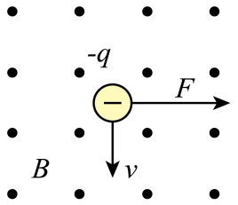
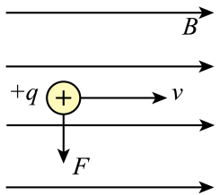
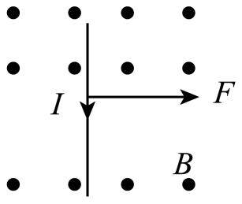
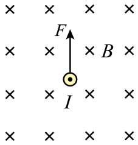

## 讲解

### 判据

已知外部磁场方向，要判断电流或运动电荷受到的磁场力，就用左手定则。题目给“点”表示向纸外，“叉”表示向纸内。若磁场来自通电直导线或线圈，先用右手螺旋定则求磁场，再用左手判断受力，两步不能合并。

导线用电流方向；正粒子用速度方向；负粒子用速度的反方向。只有受力非零时才有力的方向可判。

### 流程

1. 先画出粒子所在位置的磁场，辨清向里、向外或纸面内。对比速度或电流方向：若平行、反平行，$\sin\theta=0$，力为零，直接排除画有非零力的选项。
2. 电流四指沿电流，正电荷四指沿速度；负电荷先反转速度再放四指。这是在用等效的正电荷流方向，避免做完后再反一次。
3. 掌心迎着磁场，让拇指给出受力。若速度与磁场斜交，先取速度垂直磁场的分量，沿这个分量放四指；平行分量不贡献磁场力。
4. 检查受力是否同时垂直速度/电流与磁场。若不满足，手势或纸面方向一定有误。反转电荷符号或单独反转磁场，力应反向；两者同时反转，力应不变。
5. 问“将向哪边偏转”时，再把力与运动联系：自由粒子向该侧弯曲；有轨道约束的导线还需受力分析，不把拇指方向无条件当成实际位移方向。

大小判断独立完成：$F_B=|q|vB\sin\theta$，$F_A=BIL\sin\theta$。左手只能定方向，不能决定哪个力更大。

## 例题

> 题目与解析：第一章 安培力和洛伦兹力（专项训练）（解析版）.docx，来源ID S04，第47—54段。分段选取时保留该子问的完整题干、答案与解析；题目背景和原资料标注照录。

4．(25-26高二上·广西钦州第一中学·期中)关于安培力和洛伦兹力的方向，下列各图正确的是（    ）

A．

B．

C．

D．

**原资料答案：** A

**原资料详解：** 

A．对于负电荷，根据左手定则，伸开左手，让磁感线垂直穿过手心，四指指向负电荷运动的反方向，大拇指所指方向即为洛伦兹力方向，故A正确；

B．由于B图像中电荷的速度方向与磁场方向平行，不受洛伦兹力的作用，故B错误；

C．对于通电导线，根据左手定则，伸开左手，让磁感线垂直穿过手心，四指指向电流方向，大拇指所指方向即为安培力方向，所以C图中安培力方向应水平向左，故C错误；

D．由于D图像中电流的方向与磁场方向平行，不受安培力的作用，故D错误。

故选A。

### 顺着本题再看清一步

本题四个选项中，先检查平行关系即可排除B、D；A和C的几何方向相似，但A是负电荷，C是正向电流，不能给它们放同样的四指方向。

## 易错

- A是负电荷向下、磁场向外；四指应向上，拇指向右，图中受力正确。
- B速度平行磁场、D电流反平行磁场，都没有磁场力；图中向下或向上的箭头错误。
- C电流向下、磁场向外，受力应向左，不能按图中向右。
