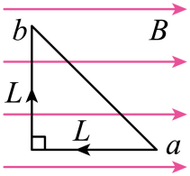
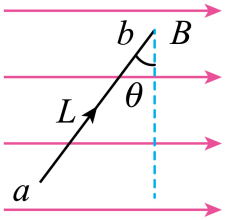
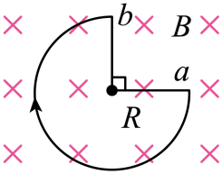
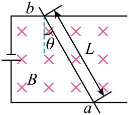

## 讲解

### 判据

题图出现弯线、圆弧、斜导线，或导线只有一部分进入磁场，先确定真正有电流且处于磁场的那一段，再判断能否用有效长度。有效长度不是导线材料的实际长度；同一匀强磁场中求某段导线的**合力**时，用从电流起点到终点的有向连线。

### 流程

1. 在图上标出磁场覆盖范围及电流始末点。场外部分不受该磁场的安培力；一个进出磁场多次的回路，应分别标出各段。
2. 磁场均匀时，把弯导线切成小直段。每段力由其有向长度决定；这些有向小段首尾相接，相加就是始末点连线。因此整段合力可用$I\mathbf L_{\rm eff}\times\mathbf B$表示。
3. 若不使用矢量形式，先算端点距离$L_{\rm eff}$，再取其与磁场夹角$\theta$，求$F=BIL_{\rm eff}\sin\theta$。也可先求连线垂直磁场的投影长度$L_\perp$，用$F=BIL_\perp$。
4. 用左手定则沿有向连线判断合力方向。直角折线中平行磁场的一边受力为零；圆弧不能以弧长代入，因为各处力方向会改变。
5. 题目若问转动、局部张力或某一小段受力，应回到分段受力图。等效长度只保留总合力，不保留力矩，也不能替代所有局部力。

非匀强磁场中不同小段的$B$不同，不能把它提出后只相加长度；这时按题给关系逐段求力。

## 例题

> 题目与解析：第一章 安培力和洛伦兹力（专项训练）（解析版）.docx，来源ID S04，第14—22段。分段选取时保留该子问的完整题干、答案与解析；题目背景和原资料标注照录。

1．(25-26高二上·浙江“七彩阳光”新高考研究联盟·期中)下列图中，通有电流大小为I的导体ab所受安培力的大小正确的是（　　）

A．

${F}_{安}=ILB$

B．

${F}_{安}=ILBsinθ$

C．

${F}_{安}=\frac{3\pi }{4}IRB$

D．

${F}_{安}=ILBcosθ$

**原资料答案：** A

**原资料详解：** 

A．导体ab所受安培力的大小为${F}_{安}=ILB$，故A正确；

B．导体ab所受安培力的大小为${F}_{安}=ILBcosθ$，故B错误；

C．导体ab所受安培力的大小为${F}_{安}=\sqrt{2}RIB$，故C错误；

D．导体ab所受安培力的大小为${F}_{安}=ILB$，故D错误。

故选A。

### 顺着本题再看清一步

A图电流从a沿水平段向左再向上到b。水平段平行磁场不受力，竖直段长度L受力BIL；A正确。C的弧长写成$3\pi R/4$还与图示圆弧不符，但即使把弧长写对也不能拿来算合力。

## 易错

- B图的$\theta$是导线与竖直辅助线夹角，导线与水平磁场夹角是$90^\circ-\theta$，故用$\cos\theta$。
- C图圆弧实际长$3\pi R/2$，两端点距离为$\sqrt2R$，所以合力为$\sqrt2BIR$。
- D图导线倾斜，但始终垂直纸面向里的磁场；夹角是90°，不需要再乘辅助角的余弦。
