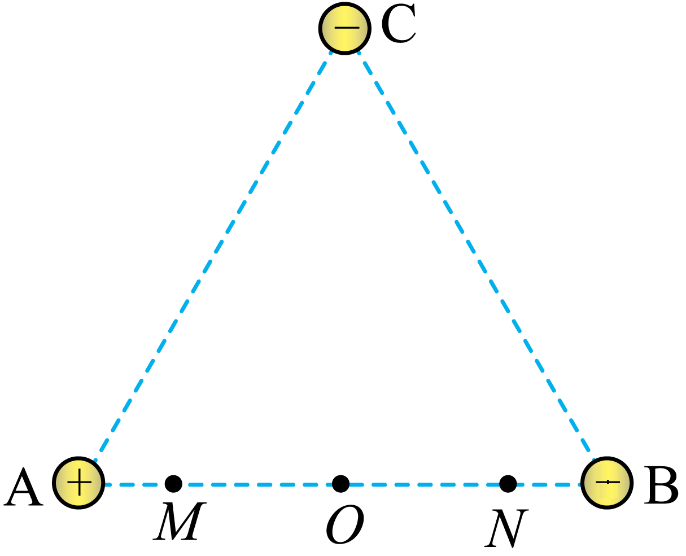

## 错法

从φ_M>φ_N直接写E_pM>E_pN，把正电荷的结论套给负电荷；或把电子电荷写成+e算完才补一句“电子是负的”。错误就在使用E_p＝qφ时漏掉q的符号。

## 正解

同一个电荷比较两个位置，用差而非分别记忆：

$$E_{pM}-E_{pN}=q(\varphi_M-\varphi_N)$$

若括号正，正q给正差，负q给负差。电势值可以同时为负数，这个差法仍成立，不用看“正负电势”猜大小。改变零点给两处同时加同一常数，不改变势能差。

做功另用初减末：W_MN＝q(φ_M−φ_N)。负电荷从M到N时，电场做负功，势能增加，和上式同一结论。

## 例题

> 题目与解析：第十章 静电场中的能量（单元测试·基础卷）（解析版）.docx，来源ID S06，第6—17段。题目背景与原资料标注照录。

1．如图所示，正三角形的顶点固定三个等量电荷，其中A带正电，B、C带负电，O、M、N为AB边的四等分点，取无穷远处电势为零，下列说法正确的是（　　）

A．O点的电势等于零

B．M点的电势大于N点的电势

C．M、N两点的电场强度相同

D．负电荷在M点的电势能比在N点大

**原资料答案：** B

**原资料详解：** ABD．由等量异种电荷电势分布可知，点电荷A、B在M、O、N三点的电势关系为$\varphi_M>\varphi_O>\varphi_N$

由于等量异种电荷连线的中垂线为等势线，且无穷远处电势为零，则点电荷A、B在O点的电势为0，由对称性可知，点电荷C在M、N两点的电势相等，在O点的电势小于零，综上所述，可知M点的电势大于N点的电势，O点的电势小于零；根据$E_p=q\varphi$

可知负电荷在M点的电势能比在N点小，故AD错误，B正确；

C．根据等量异种电荷电场分布可知，点电荷A、B在M、N两点的电场强度大小相等，方向相同；由对称性可知，点电荷C在M、N两点的电场大小相等，方向不同，则M、N两点的电场强度不同，故C错误。

故选B。

### 顺着本题再看清一步

本题B正确；D错误，因为q<0而φ_M−φ_N>0，故E_pM−E_pN<0。A错在漏第三源C，所以φ_O不是零；C错在把C对两点大小相等、方向不同的场当成相同。三源的标量电势和矢量场强要分别叠加。
