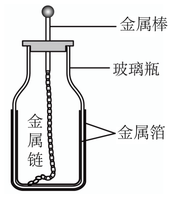

## 错法

从C＝Q/U看到充电后Q增加，就断言C增加；或未充电时Q＝0便断言没有电容。错误是把定义式里一起变化的Q和U当成只有Q变，并把存量当成容纳本领。

## 正解

固定几何和线性介质，C由结构决定，Q＝CU。提高电压时Q同步增加，Q/U不变；Q减少若由放电引起，U也减少，不能只看Q推C。

平行板C＝ε_rS/(4πkd)：改变S、d或介质才改变该模型下的C。若观察Q改变且题给U固定，才可由C＝Q/U反推C改变；要把“U固定”写进理由。

本题瓶壁厚度d是两金属箔间距，金属箔自身厚度不是d。未充电的0/0不能用来定义数值，但物体仍有电容，可看结构或再次充电响应。

## 例题

> 题目与解析：第十章 静电场中的能量（专项训练）（解析版）.docx，来源ID S02，第236—253段。题目背景与原资料标注照录。

18．莱顿瓶可看作电容器的原型，一个玻璃容器内外包裹导电金属箔作为极板，一端接有金属球的金属棒通过金属链与内侧金属箔连接，但与外侧金属箔绝缘。从结构和功能上来看，莱顿瓶可视为一种早期的平行板电容器。

关于莱顿瓶，下列说法正确的是（　　）

A．充电电压一定时，玻璃瓶瓶壁越薄，莱顿瓶能容纳的电荷越多

B．瓶内外锡箔的厚度越厚，莱顿瓶容纳电荷的本领越强

C．充电电压越大，莱顿瓶容纳电荷的本领越强

D．莱顿瓶的电容大小与玻璃瓶瓶壁的厚度无关

**原资料答案：** A

**原资料详解：** 

A．根据$C=\frac{\varepsilon_r S}{4\pi kd}$

$C=\frac QU$

解得$Q=\frac{\varepsilon_r SU}{4\pi kd}$

充电电压一定时，玻璃瓶瓶壁越薄，d越小，莱顿瓶能容纳的电荷Q越多，A正确；

B．根据$C=\frac{\varepsilon_r S}{4\pi kd}$

瓶内外锡箔的厚度与电容大小无关，因此锡箔纸厚度增加，C不变，莱顿瓶容纳电荷的本领不变，B错误；

C．根据$C=\frac{\varepsilon_r S}{4\pi kd}$

充电电压与电容C大小无关，充电电压升高，莱顿瓶容纳电荷的本领不变，C错误；

D．根据$C=\frac{\varepsilon_r S}{4\pi kd}$

莱顿瓶的电容大小与玻璃瓶瓶壁的厚度d有关，D错误。

### 顺着本题再看清一步

A正确，U固定且玻璃壁d变小，使C大、Q多；B增加箔自身厚度不是改变隔层d；C增加U只让Q同倍增加，C不变；D壁厚影响C，错。莱顿瓶曲面在资料中按薄壁局部平行板近似，不能把这条公式无条件当任何形状的精确电容。
