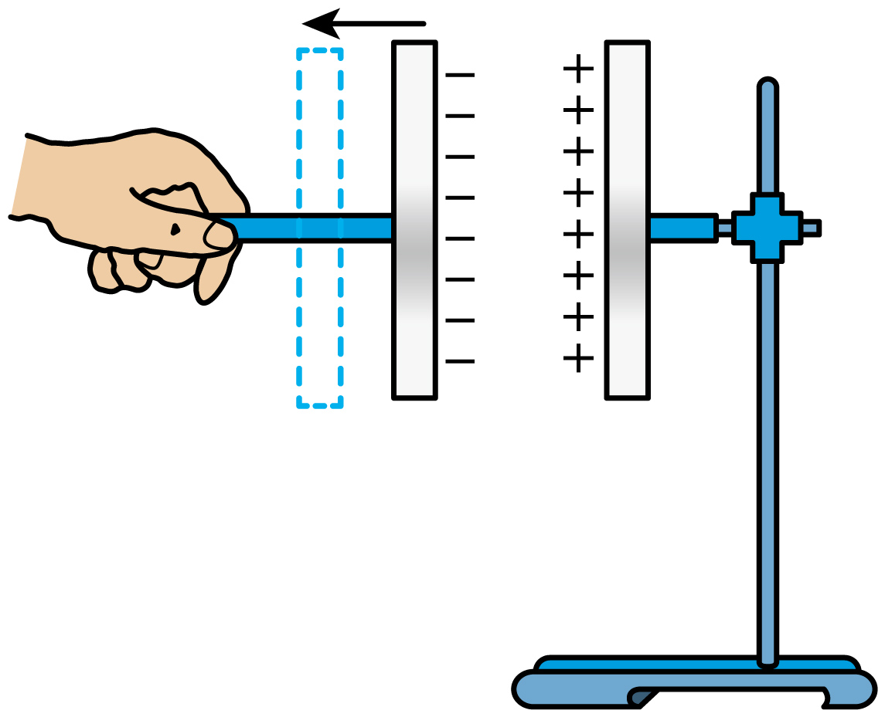

## 错法

记住“电容器电压等于电源”，断开后还拿这个电压固定分析；拉大d时直接用E＝U/d说E减小。错误是没有在断电时重新确定边界条件。

还有反向错法：接电源时却把Q固定，认为没有可移动电荷。保持连接时恰可充放电调整Q。

## 正解

断开并隔离且无漏电时，极板的净电荷量Q固定，电源不再控制U；结构变则C变，U＝Q/C也可变。

本题d增大、S与ε_r不变，C与1/d成比例，所以U与d成比例。将两个同时变化的量代入E＝U/d，不能只看分母：

$$E=\frac Q{Cd}=\frac{4\pi kQ}{\varepsilon_rS}$$

于是E与d无关。若接电源改为恒U，d增大则E减小，但这已经换了题设，不能混用两种答案。

## 例题

> 题目与解析：第十章 静电场中的能量（单元测试·基础卷）（解析版）.docx，来源ID S06，第51—60段。题目背景与原资料标注照录。

4．如图所示，带绝缘柄的两极板组成孤立的带电平行板电容器，极板正对面积为S。在图示位置静止不动时，两极板之间的场强为E，两板之间介质的介电常数为$\varepsilon_r$，静电力常量为$k$。某时刻人手开始缓慢向左移动，逐渐拉开两极板之间的距离，当人手向左移动较小的距离时（　　）

A．电容器的电容不变

B．电容器的电容变大

C．电场强度E变小

D．电场强度E不变

**原资料答案：** D

**原资料详解：** AB．设两极板之间的距离为d，根据电容器的电容$C=\frac{\varepsilon_r S}{4\pi kd}$可知，当某时刻人手开始缓慢向左移动，逐渐拉开两极板之间的距离，d 增大时，电容器的电容减小，AB错误；

CD．根据$E=\frac Ud$，$U=\frac QC$，结合电容器的电容$C=\frac{\varepsilon_r S}{4\pi kd}$

联立解得$E=\frac Q{Cd}=\frac{4\pi kQ}{\varepsilon_r S}$

可见当d增大时，E不变，C错误，D正确。

故选D。

### 顺着本题再看清一步

A、B错误，电容实际减小；C误用了恒压结果，错误；D正确，孤立Q恒定、板距变化较小且仍满足忽略边缘的平行板模型，E不变。

真实器材若有漏电或接入仪表改变系统，Q恒定应重新核对，不把“断开电源”字样当成排除所有电荷通道的万能条件。
