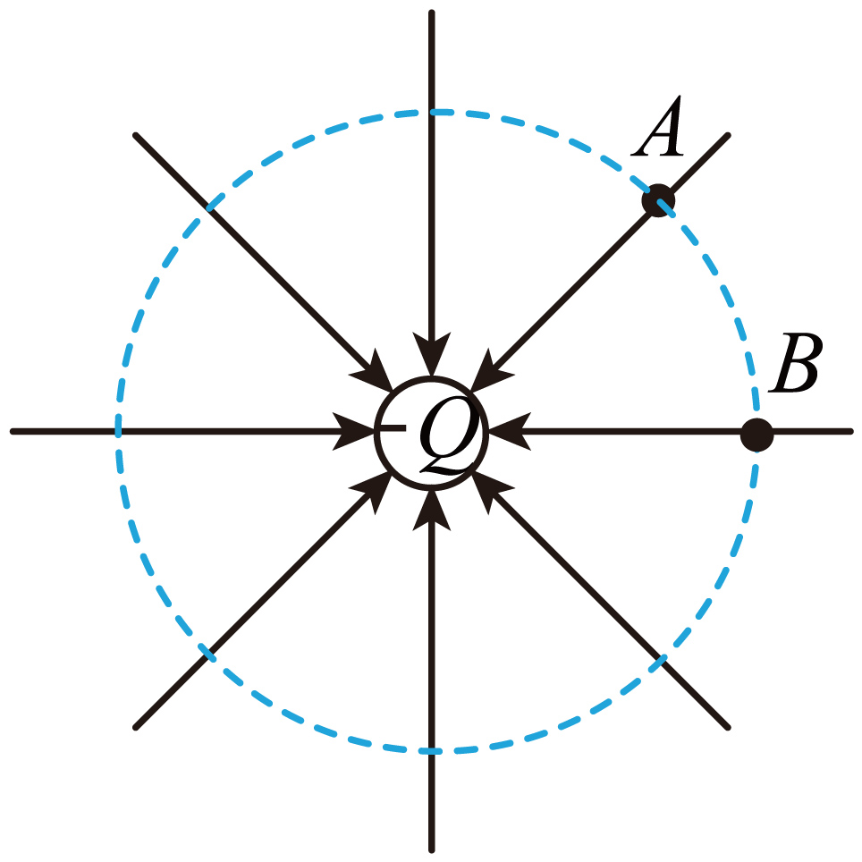
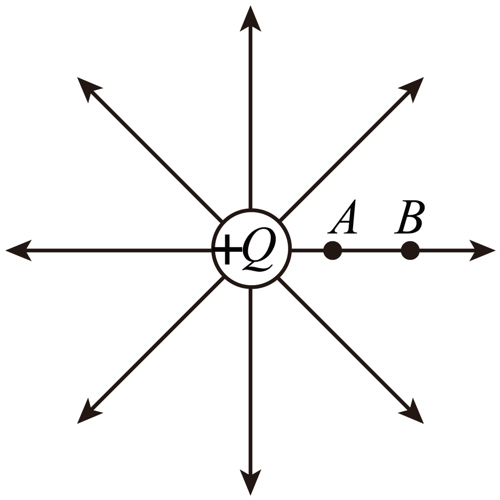
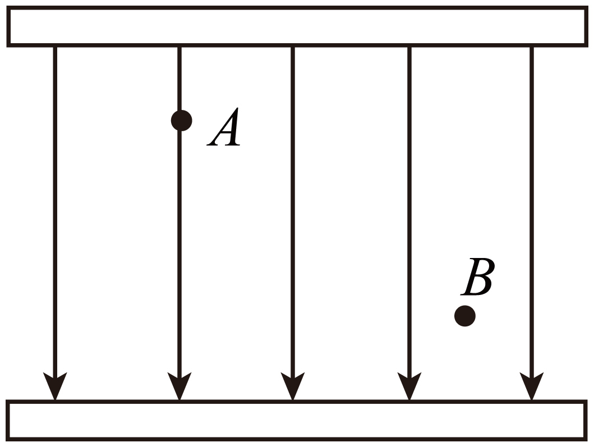
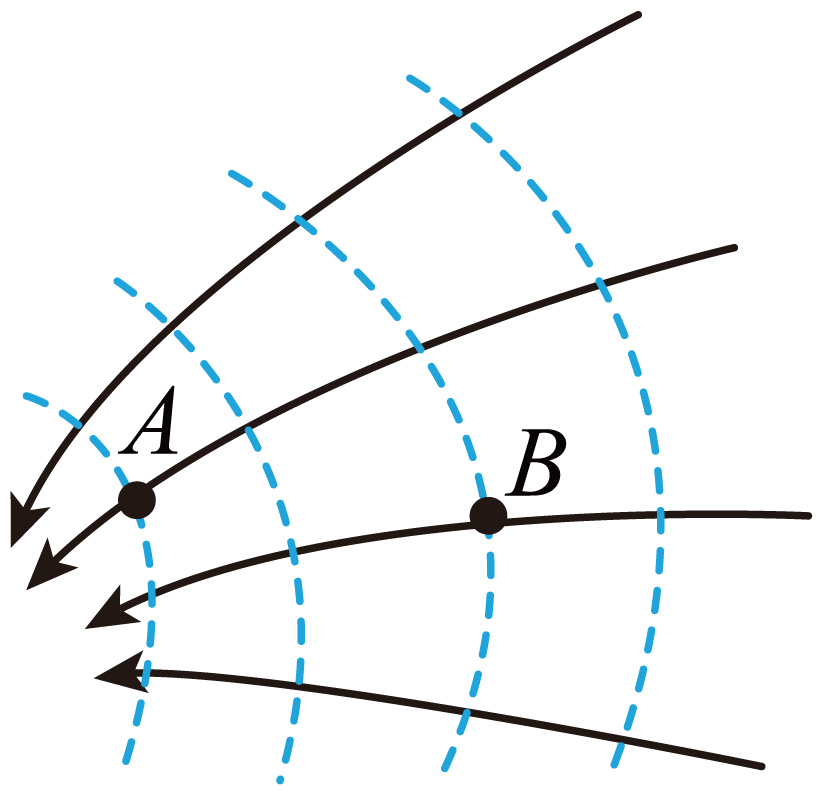

## 讲解

### 是什么

在所研究区域内，场强大小相等、方向相同的电场叫匀强电场。匀强指矢量E处处相同，不是只在若干点量得大小相等。图形特征是等间距、同方向的平行电场线。

给定带电量q的粒子在其中受恒定电场力F＝qE。粒子受力恒定不等于速度恒定，也不等于沿场线运动；还要看初速度和其他力。

### 怎么来的

正对的两块足够大、靠近的平行金属板带等量异种电荷时，中部场相互叠加，离边缘较远的区域可近似为匀强；边缘附近场线弯曲，不能保持同一个方向与疏密。

本题负点电荷等半径两点（A项）只满足大小相等，指向中心的方向不同；正点电荷同一径向两点（B项）只满足方向相同，距离改变使大小改变。C项在平行板中部，两点方向和疏密一致，因此才同时满足“相同”。

### 什么时候能用

匀强区域内可用恒力模型，将电场力与重力等一起求合力，再用牛顿定律判断运动。场源改动、引入导体、靠近极板边缘时都要重新核对匀强近似，不能把原区域一直视为不受干扰。

有限板中部的近似要求研究尺度和边缘距离合适；“所有平行板任何位置的场都严格匀强”是不成立的。

## 例题

> 题目与解析：第九章 静电场及其应用（专项训练）（解析版）.docx，来源ID S02，第210—218段。题目背景与原资料标注照录。

17．（24-25高二上·福建福州·期末）下列各电场的电场线分布图中，A、B两点的电场强度相同的是（　　）

A．

B．

C．

D．

**原资料答案：** C

**原资料详解：** 

A．A、B两点电场强度大小相等，方向不同，故A错误；

B．A点电场强度大于B点电场强度，方向相同，故B错误；

C．A、B两点电场强度大小相等，方向相同，故C正确；

D．A点电场强度大于B点电场强度，方向不同，故D错误。

故选C。

### 顺着本题再看清一步

A大小相等而方向不同；B方向相同而大小不同；C大小方向都相同，正确；D场线疏密与方向均不同。判断“同一矢量”要逐一检查这两个条件，不能凭一项合格就停止。

## 易错

点电荷球面上的等场强大小不是匀强场；匀强场也可以使有横向初速度的粒子做曲线运动。
